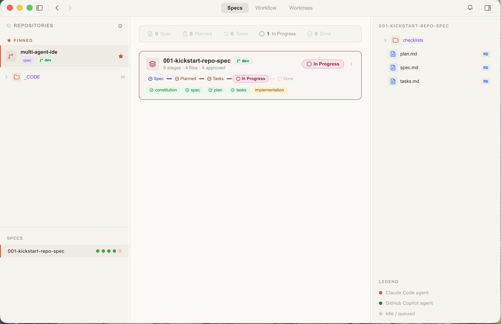

# Magenta IDE

**Multi-Repo · Multi-Agent · Full IDE**

A desktop-first developer tool that manages the full software development lifecycle across multiple repositories simultaneously. Magenta IDE orchestrates the **Spec → Plan → Task → Implement → Review** pipeline, dispatching implementation work to AI agents (Claude Code, GitHub Copilot) in dedicated git worktrees.



---

## Table of Contents

- [What is Magenta IDE?](#what-is-magenta-ide)
- [Prerequisites](#prerequisites)
- [Installation](#installation)
- [First Launch & Setup](#first-launch--setup)
- [How to Use Magenta IDE](#how-to-use-magenta-ide)
  - [1 — Add a Working Directory](#1--add-a-working-directory)
  - [2 — Browse Repositories & Specs](#2--browse-repositories--specs)
  - [3 — Author & Progress a Spec](#3--author--progress-a-spec)
  - [4 — Dispatch Work to an AI Agent](#4--dispatch-work-to-an-ai-agent)
  - [5 — Monitor Progress & Review](#5--monitor-progress--review)
  - [6 — Create a Pull Request](#6--create-a-pull-request)
- [Settings](#settings)
- [Troubleshooting](#troubleshooting)
- [Build from Source](#build-from-source)
- [For Developers](#for-developers)
- [License](#license)

---

## What is Magenta IDE?

Magenta IDE is a desktop application that helps your team manage the entire software development lifecycle across multiple git repositories — all from a single window. It connects spec authoring, AI-assisted implementation, and pull-request creation into one smooth workflow.

**Key capabilities at a glance:**

- 📁 **Multi-repo management** — point Magenta at any folder; it discovers all git repositories automatically.
- 📝 **Spec-driven development** — author specs in a rich markdown editor and track them through a structured pipeline (Constitution → Spec → Plan → Tasks → Implementation).
- 🤖 **AI agent dispatch** — send tasks to Claude Code or GitHub Copilot, each running in an isolated git worktree so it never conflicts with your main branch.
- 📊 **Live monitoring** — stream agent logs and view a real-time pipeline flow diagram.
- 🔀 **PR workflow** — create pull requests directly from the completed agent work inside the IDE.
- 💾 **Session persistence** — your workspace layout is saved and restored automatically every time you open the app.

---

## Prerequisites

Before installing Magenta IDE, make sure the following tools are available on your machine:

| Tool | Minimum version | Notes |
|---|---|---|
| **Git** | 2.30+ | Required for all repository operations and git worktree support |
| **Claude Code CLI** (`claude`) | latest | Required if you plan to dispatch work to Claude Code |
| **GitHub CLI** (`gh`) | latest | Required if you plan to dispatch work to GitHub Copilot |

> **macOS / Linux:** install the CLIs via their official installers or Homebrew.
> **Windows:** use the official Windows installers from the respective product pages.

You do **not** need Node.js installed to run the pre-built app — it is bundled inside the Electron package.

---

## Installation

### Option A — Download the pre-built app (recommended)

Go to the [**Releases page**](https://github.com/baoduy/multi-agent-ide/releases) and download the installer for your platform.

| Platform | File to download | How to install |
|---|---|---|
| **macOS (Apple Silicon)** | `Magenta-IDE-*-mac-arm64.dmg` | Open the `.dmg`, drag **Magenta IDE** to `/Applications` |
| **macOS (Intel)** | `Magenta-IDE-*-mac-x64.dmg` | Open the `.dmg`, drag **Magenta IDE** to `/Applications` |
| **Windows** | `Magenta-IDE-Setup-*-x64.exe` | Run the installer; choose your installation directory |
| **Linux (AppImage)** | `Magenta-IDE-*-x64.AppImage` | `chmod +x Magenta-IDE-*.AppImage` then run it |
| **Linux (Debian/Ubuntu)** | `Magenta-IDE-*-x64.deb` | `sudo dpkg -i Magenta-IDE-*.deb` |

#### macOS security note

Because the app is not yet signed with an Apple Developer certificate, macOS Gatekeeper may block the first launch. To fix this, open **Terminal** and run:

```bash
xattr -cr /Applications/Magenta\ IDE.app
```

Then open the app normally. Alternatively, right-click the app icon and choose **Open** to bypass Gatekeeper once.

#### Windows security note

Windows SmartScreen may show a warning for unsigned applications. Click **More info → Run anyway** to proceed with the installation.

---

### Option B — Build from source

If you prefer to build the app yourself (or want to contribute), see the [Build from Source](#build-from-source) section below.

---

## First Launch & Setup

### Step 1 — Launch Magenta IDE

Open the app from your Applications folder (macOS), Start Menu (Windows), or by running the AppImage (Linux).

### Step 2 — Onboarding wizard

On first launch the **Onboarding** dialog will appear. It walks you through:

1. **Choose your AI agent** — select Claude Code or GitHub Copilot (you can change this later in Settings).
2. **Set the agent command path** — confirm the path to the `claude` or `gh` executable if it is not on your system `PATH`. You can find the path by running `which claude` (macOS/Linux) or `where claude` (Windows) in a terminal.
3. **Enable git worktree isolation** *(optional but recommended)* — each AI agent run gets its own isolated git branch.

### Step 3 — Add a working directory

After onboarding, click **⚙ Settings** (gear icon in the title bar) and add one or more **working directories**. A working directory is any folder that contains your git repositories — for example `~/Projects` or `C:\Code`.

Magenta will scan the folder (up to 3 levels deep), discover all git repositories, and list them in the left sidebar.

---

## How to Use Magenta IDE

### 1 — Add a Working Directory

1. Click the **⚙ Settings** icon in the title bar.
2. Under **Working Directories**, click **+ Add directory** and select your projects folder.
3. Magenta scans the folder and populates the **Repositories** sidebar. You can add as many working directories as you need.

> **Tip:** Repositories are refreshed automatically when files change on disk. You can also trigger a manual rescan from the context menu on any repository.

---

### 2 — Browse Repositories & Specs

- The **left sidebar** lists every discovered repository. Click a repository to select it.
- Each repository entry shows its current branch and spec count.
- Expand a repository to see its **spec folders** (sub-folders that contain a `spec.md` file are detected automatically).
- Click a spec folder to open the pipeline view in the main area.

---

### 3 — Author & Progress a Spec

A spec moves through five stages:

```
Constitution  →  Spec  →  Plan  →  Tasks  →  Implementation
```

Each stage is colour-coded in the pipeline flow diagram:
- 🔵 **Blue** — pending / draft
- 🟡 **Yellow** — in review
- 🟢 **Green** — approved / done

**To create or edit a stage document:**

1. Select a spec in the sidebar.
2. The main panel shows the pipeline flow diagram. Click any stage node to open its markdown editor.
3. Write or paste your content (the editor supports syntax highlighting and Mermaid diagrams).
4. When ready, click **Mark for review** and then **Approve** to advance the stage status.

**Stage documents** are plain markdown files saved inside your repository under the spec folder — no proprietary format, fully version-controlled.

---

### 4 — Dispatch Work to an AI Agent

Once the **Tasks** stage is approved, you can send the work to an AI agent:

1. Click **Create Worktree** in the activity panel (right sidebar) or the pipeline diagram.
2. Magenta creates an isolated git worktree branch for the agent.
3. The AI agent (Claude Code or GitHub Copilot) is launched in that worktree and begins implementing the tasks.
4. You can run multiple agents simultaneously across different repositories or specs.

> **Concurrency controls:** Each repository has a configurable agent limit. Use the global **Pause** button in the title bar to temporarily stop all running agents.

---

### 5 — Monitor Progress & Review

- The **Activity panel** (right sidebar) streams the live terminal output from the running agent.
- The **pipeline flow diagram** updates in real time — node colours change as stages complete.
- Diff output and file changes are visible in the activity panel once the agent finishes.
- Click any worktree entry to inspect its branch, status, and log output.

---

### 6 — Create a Pull Request

When the agent has finished and you are happy with the result:

1. Open the **Worktree panel** for the completed worktree.
2. Click **Create Pull Request**.
3. Magenta calls the GitHub CLI (`gh pr create`) in the background and opens the new PR in your browser.

The worktree branch can then be deleted from the same panel once the PR is merged.

---

## Settings

Open **⚙ Settings** from the title bar to manage:

| Setting | Description |
|---|---|
| **Working directories** | Add or remove the root folders Magenta scans for repositories |
| **AI agent** | Switch between Claude Code and GitHub Copilot |
| **Agent command path** | Full path to the `claude` or `gh` executable |
| **Worktree isolation** | Enable/disable per-repository worktree isolation |

Settings are persisted automatically in a local SQLite database — no config file to edit by hand.

---

## Troubleshooting

### The app won't open on macOS
Run `xattr -cr /Applications/Magenta\ IDE.app` in Terminal and try again. See [macOS security note](#macos-security-note).

### Repositories are not appearing in the sidebar
- Make sure you have added a working directory in **Settings**.
- Confirm that the directories contain `.git` folders at most 3 levels deep.
- Try right-clicking the working directory entry and selecting **Rescan**.

### The AI agent command is not found
- Open **Settings** and verify the **Agent command path** points to the correct executable.
- On macOS/Linux you can find the path with `which claude` or `which gh`.
- On Windows use `where claude` or `where gh` in Command Prompt.

### An agent run failed immediately
- Check that Git is installed and on your `PATH` (`git --version` should print a version number).
- Check that git worktrees are supported: `git worktree list` in any repo should work.
- Review the agent log in the Activity panel for the specific error message.

### My workspace layout was lost
Your layout is stored in the local SQLite database. If you need to reset it, delete the database file at:
- **macOS:** `~/Library/Application Support/Magenta IDE/`
- **Windows:** `%APPDATA%\Magenta IDE\`
- **Linux:** `~/.config/Magenta IDE/`

---

## Build from Source

> Only needed if you want to build the app yourself or contribute code.

### Requirements

| Tool | Version |
|---|---|
| Node.js | 22+ |
| pnpm | 10+ |
| Git | 2.30+ |

### Steps

```bash
# 1. Clone the repository
git clone https://github.com/baoduy/multi-agent-ide.git
cd multi-agent-ide

# 2. Install all dependencies (monorepo workspaces)
pnpm install

# 3a. Run in development mode (build + launch Electron)
pnpm dev

# 3b. Or, run with hot-reload for active development
pnpm dev:watch
```

### Create a distributable package

```bash
# Build for your current platform
pnpm dist

# Platform-specific builds
pnpm dist:mac       # macOS (.dmg + .zip for both x64 and arm64)
pnpm dist:win       # Windows (.exe NSIS installer, x64)
pnpm dist:linux     # Linux (.AppImage + .deb, x64)
```

Built artifacts are placed in the `release/` directory.

---

## For Developers

If you are contributing to or extending Magenta IDE, see the following references:

- **Architecture overview** — [`docs/architecture/architecture-overview.md`](docs/architecture/architecture-overview.md)
- **AI agent development guide** — [`CLAUDE.md`](CLAUDE.md) — authoritative rules for layering, IPC endpoints, error handling, and anti-patterns
- **Available scripts**

| Command | Description |
|---|---|
| `pnpm dev` | Build all packages, then launch Electron |
| `pnpm dev:watch` | Parallel watch mode (hot-reload) |
| `pnpm build` | Build all packages for production |
| `pnpm typecheck` | TypeScript type-checking across all packages |
| `pnpm lint` | Run linters across all packages |
| `pnpm test` | Run all test suites |

---

## License

MIT
