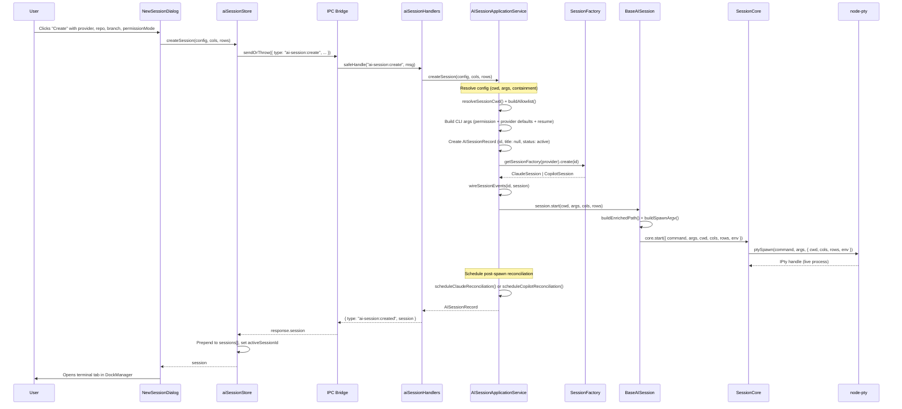
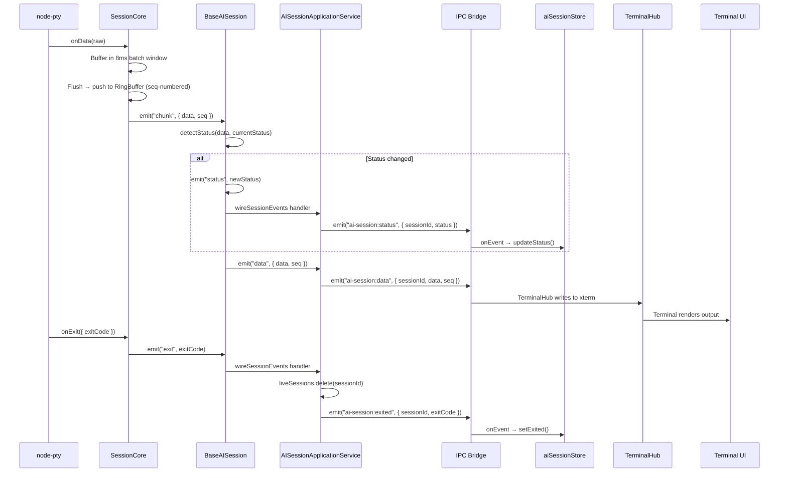
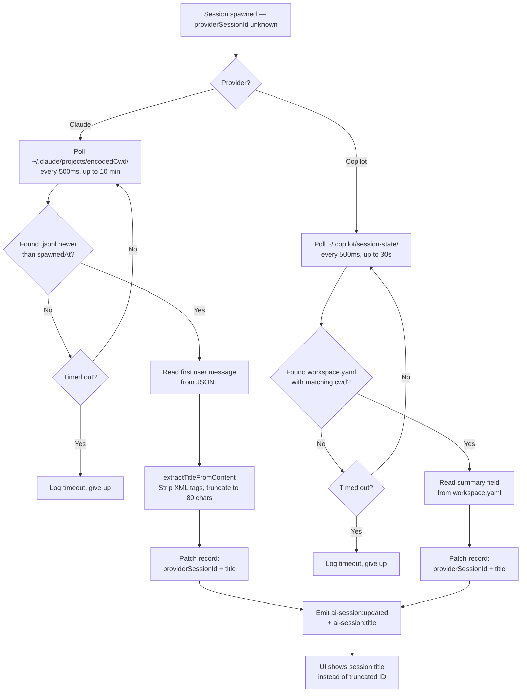

# AI Session Creation Flow

This document traces the complete lifecycle of creating an AI session in Magenta IDE — from the moment a user clicks "New Session" to a live PTY streaming terminal output.

## High-Level Sequence



## Live Event Flow (Post-Creation)



## Reconciliation & Title Discovery



---

## Step-by-Step Walkthrough

### Step 1 — UI Trigger (NewSessionDialog)

**File:** `packages/ui/src/renderer/components/dialogs/NewSessionDialog.tsx`

The user fills out a form selecting provider (Claude or Copilot), repository, branch, worktree, and permission mode. On submit, the dialog calls the store's `createSession()` with the config and default terminal dimensions (80×24).

```typescript
const session = await createSession(
  {
    provider,
    repoPath: selectedRepoPath,
    branch: branchToUse,
    worktreePath: worktreePathToUse,
    permissionMode: permissionMode as AIPermissionMode,
    providerSessionId: resumeContext?.providerSessionId,
  },
  80, 24,
);
onSessionCreated?.(session);
```

### Step 2 — Store Sends IPC Request (aiSessionStore)

**File:** `packages/ui/src/renderer/store/aiSessionStore.ts`

The `createSession` action uses `sendOrThrow()` to fire a typed IPC request to the daemon. On success, it prepends the new session to the store's list and sets it as active.

```typescript
createSession: async (config, cols, rows) => {
  const response = await sendOrThrow({
    type: "ai-session:create",
    provider: config.provider,
    repoPath: config.repoPath,
    branch: config.branch,
    worktreePath: config.worktreePath,
    permissionMode: config.permissionMode,
    providerSessionId: config.providerSessionId,
    cols, rows,
  });
  const session = response.session;
  set((state) => ({
    sessions: [session, ...state.sessions],
    activeSessionId: session.id,
  }));
  return session;
},
```

### Step 3 — IPC Schema Validation

**File:** `packages/shared/src/ipc.ts`

The request is validated against the `IpcRequestSchema` discriminated union. The `ai-session:create` variant expects `provider`, optional `repoPath`/`branch`/`worktreePath`/`permissionMode`/`providerSessionId`, and required `cols`/`rows`. The response type is `ai-session:created` containing the full `AISessionRecord`.

### Step 4 — Handler Delegates to Application Service

**File:** `packages/daemon/src/ipc/handlers/aiSessionHandlers.ts`

A thin `safeHandle` handler receives the typed request and passes it straight through to the application service — no logic in the handler itself, following the project's handler rules.

```typescript
safeHandle(bridge, "ai-session:create", async (msg) => {
  const session = await aiSessionService.createSession(
    { provider: msg.provider, repoPath: msg.repoPath, ... },
    msg.cols, msg.rows,
  );
  return { type: "ai-session:created", session };
});
```

### Step 5 — Application Service Resolves Config

**File:** `packages/daemon/src/application/AISessionApplicationService.ts`

`createSession()` performs several resolution steps before spawning anything:

1. **Provider metadata** — `getProviderMeta(provider)` returns the binary name, default args, and provider-specific config.
2. **Working directory** — `resolveSessionCwd()` picks between `worktreePath` or `repoPath` as the effective cwd.
3. **Path containment** — `resolveAndAssert()` + `buildAllowlist()` ensure the cwd is within the user's allowed directory tree. This prevents escape-to-root bugs.
4. **Directory creation** — `fs.mkdir(cwd, { recursive: true })` ensures the path exists.

### Step 6 — CLI Arguments Assembled

Still in `AISessionApplicationService.createSession()`, the CLI args are built from three sources:

- **Permission flags** — `getPermissionModeArgs(provider, permissionMode)` (e.g., `--dangerously-skip-permissions` for trust mode)
- **Provider defaults** — `providerMeta.defaultArgs` (e.g., `--verbose` or format flags)
- **Resume flags** — if resuming: `--resume <id>` (Claude) or `--resume=<id>` (Copilot)

### Step 7 — In-Memory Record Created

An `AISessionRecord` is built with a fresh `randomUUID()`, `status: "active"`, and `title: null`. This record is stored only in memory (`this.records` Map) — not in SQLite. The comment in the service explains why: the authoritative record lives on disk (`~/.claude/` or `~/.copilot/`) and is picked up by `SessionSyncApplicationService` for persistence.

```typescript
const record: AISessionRecord = {
  id,
  provider,
  repoPath, repoName,
  branch, worktreePath, worktreeName,
  cwd,
  providerSessionId: initialProviderSessionId,
  status: "active",
  permissionMode,
  title: null,
  createdAt: now,
  lastActiveAt: now,
};
this.records.set(id, record);
```

### Step 8 — Session Factory Creates the Concrete Session

**File:** `packages/daemon/src/infrastructure/sessions/SessionFactory.ts`

`getSessionFactory(provider)` returns a `ClaudeSessionFactory` or `CopilotSessionFactory`. Each factory's `.create(id)` instantiates the concrete session class.

```typescript
const FACTORIES: Record<AIProvider, ISessionFactory> = {
  claude: new ClaudeSessionFactory(),
  copilot: new CopilotSessionFactory(),
};
```

`ClaudeSession` and `CopilotSession` extend `BaseAISession`, providing only two overrides: `getBinaryName()` (returns `"claude"` or `"copilot"`) and `detectStatus()` (provider-specific regex for `waiting-input` ↔ `active` transitions).

### Step 9 — Event Wiring

Back in `AISessionApplicationService`, `wireSessionEvents(id, session)` connects the session's EventEmitter outputs to IPC bridge push events so the UI receives live updates:

| Session Event | IPC Push Event | UI Handler |
|---|---|---|
| `data` | `ai-session:data` | TerminalHub → xterm |
| `status` | `ai-session:status` | `aiSessionStore.updateStatus()` |
| `exit` | `ai-session:exited` | `aiSessionStore.setExited()` |
| `heartbeat` | `ai-session:heartbeat` | Liveness indicator |

### Step 10 — PTY Spawns

**Files:** `BaseAISession.ts` → `SessionCore.ts`

`session.start(cwd, args, cols, rows)` triggers the actual process spawn:

1. **PATH enrichment** — `buildEnrichedPath()` adds common bin directories (`/opt/homebrew/bin`, `~/.volta/bin`, `~/.bun/bin`, `~/.cargo/bin`, etc.) to cover Electron's limited environment.
2. **Login shell wrapping** — `buildSpawnArgv()` wraps the binary in a login shell on macOS/Linux: `/bin/bash -l -i -c 'exec claude ...'`. This ensures shell rc files activate (critical for nvm, volta, pyenv, etc.). On Windows, the binary is spawned directly.
3. **PTY spawn** — `SessionCore.start()` calls `node-pty`'s `ptySpawn()` with the resolved command, args, cwd, dimensions, and environment.
4. **Output buffering** — PTY data is buffered in 8ms batches, pushed to a 4MB ring buffer with monotonic seq numbers. This enables the UI to reattach after a reload without losing output.
5. **Heartbeat** — A 2-second heartbeat timer starts, emitting `headSeq` and `alive` status so the UI knows the session is still running.

### Step 11 — Post-Spawn Reconciliation

Since neither Claude Code nor Copilot accept a session ID at launch (they generate their own), Magenta doesn't know the provider's UUID immediately. A background poller bridges the gap:

**Claude** — polls `~/.claude/projects/<encodedCwd>/` every 500ms for up to 10 minutes, looking for a `.jsonl` file whose mtime is after the spawn timestamp. On match, it reads the first user message to extract a human-readable title via `extractTitleFromContent()`.

**Copilot** — polls `~/.copilot/session-state/` every 500ms for up to 30 seconds, matching `workspace.yaml` files whose `cwd` field matches. The `summary` field from the YAML is used as the session title.

Both paths patch `providerSessionId` and `title` on the record, then emit `ai-session:updated` (full record replacement) and `ai-session:title` (targeted title update) to the UI.

### Step 12 — Response Arrives in the UI

The IPC response `{ type: "ai-session:created", session }` arrives back at the store. The session is prepended to the list and set as active. The `NewSessionDialog` calls `onSessionCreated(session)`, which triggers `AISessionsView` to open the session as a center tab in the DockManager. The terminal component attaches to the session's output stream and begins rendering.

---

## Key Files Reference

| Layer | File | Role |
|---|---|---|
| UI Dialog | `packages/ui/.../dialogs/NewSessionDialog.tsx` | User-facing form |
| Store | `packages/ui/.../store/aiSessionStore.ts` | State management + IPC calls |
| IPC Schema | `packages/shared/src/ipc.ts` | Request/response Zod schemas |
| Handler | `packages/daemon/.../handlers/aiSessionHandlers.ts` | Thin IPC adapter |
| App Service | `packages/daemon/.../application/AISessionApplicationService.ts` | Orchestration, config resolution, reconciliation |
| Status Detection | `packages/daemon/.../domain/statusDetection.ts` | PTY output → status transitions |
| Session Parser | `packages/daemon/.../domain/claudeSessionParser.ts` | JSONL parsing + title extraction |
| Session Factory | `packages/daemon/.../sessions/SessionFactory.ts` | Provider → concrete session class |
| Base Session | `packages/daemon/.../sessions/BaseAISession.ts` | Login shell wrapping, PTY lifecycle |
| Session Core | `packages/daemon/.../terminal/SessionCore.ts` | node-pty spawn, ring buffer, batching |
| Provider Registry | `packages/daemon/.../domain/providerRegistry.ts` | Binary names, default args, permission flags |
