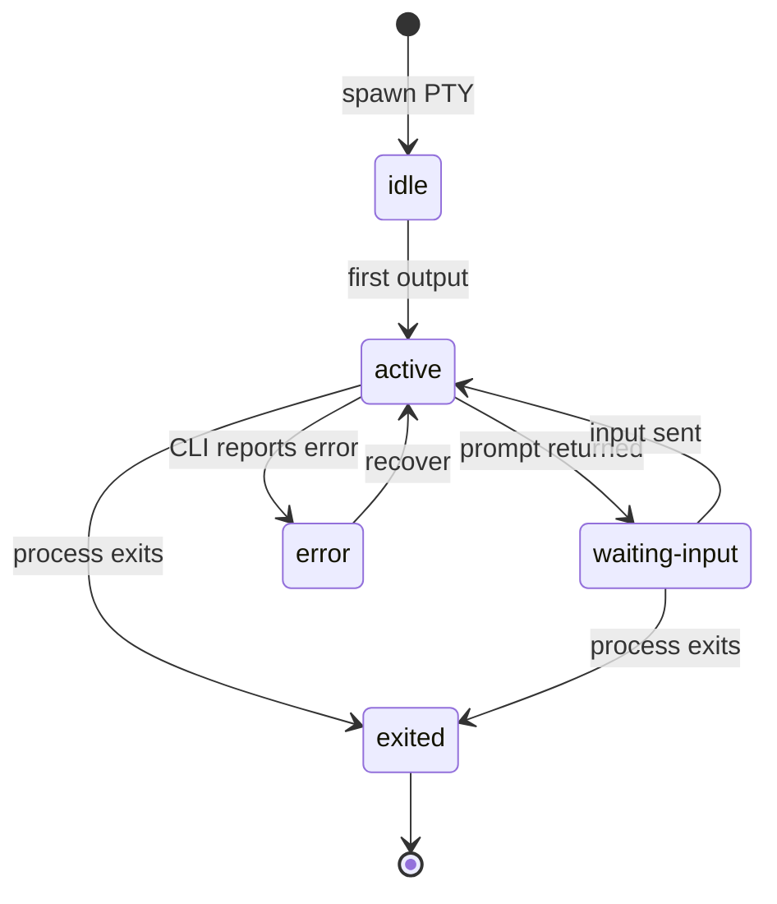
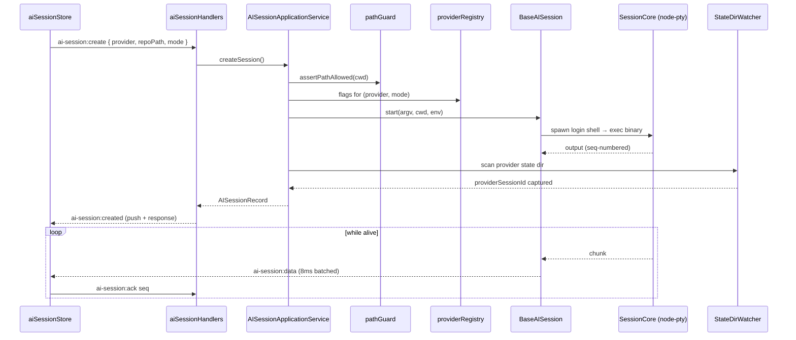

# AI Sessions (Live PTY Agents)

## Purpose

An AI session is a live Claude Code or GitHub Copilot CLI running inside a PTY hosted by the daemon. Magenta IDE spawns the CLI with permission-mode flags chosen by the user, streams stdout/stderr back to an xterm.js instance in the renderer with sequence-numbered flow control, and lets the user resume sessions (including sessions the background sync job has discovered on disk — see [`synced-sessions.md`](./synced-sessions.md)). Live sessions are in-memory only. The disk-backed synced-sessions layer is the source of truth for history; app restarts kill PTYs and the sync layer reconstructs the list.

## User-visible surface

- `AISessionsView.tsx` — the center tab for AI work. Hosts the `UnifiedSessionTree` (live + synced sessions grouped by cwd/repo) and the attached xterm instance.
- `UnifiedSessionTree.tsx` — the grouped list; each row is an `AISessionListItem` showing provider icon, status, title, branch, permission mode.
- `NewSessionDialog.tsx` — launch UI. Picks provider, target repo, optional branch, optional worktree, and permission mode. When the "resume" entry point is used (from a synced-session row), the dialog preseeds `providerSessionId`.
- `SpecifyOnboardBanner.tsx` — inlined into the dialog when the selected repo has not been onboarded yet.

## IPC contract

Types declared in `packages/shared/src/ipc.ts`; record shape in `packages/shared/src/aiTerminal.ts`.

| Direction | Type | Payload |
|-----------|------|---------|
| Request | `ai-session:create` | `{ provider, repoPath?, branch?, worktreePath?, permissionMode?, providerSessionId?, cols, rows }` |
| Request | `ai-session:resume` | `{ sessionId, cols, rows }` |
| Request | `ai-session:input` | `{ sessionId, data }` |
| Request | `ai-session:resize` | `{ sessionId, cols, rows }` |
| Request | `ai-session:stop` | `{ sessionId }` |
| Request | `ai-session:attach` | `{ sessionId, fromSeq? }` |
| Request | `ai-session:ack` | `{ sessionId, seq }` |
| Request | `ai-session:list` | — |
| Request | `ai-session:delete` | `{ sessionId }` |
| Request | `ai-session:providers` | — |
| Request | `ai-session:set-permission-mode` | `{ sessionId, permissionMode }` |
| Request | `ai-session:running-count` | — |
| Request | `ai-session:check-worktree` | `{ worktreePath, repoPath }` |
| Push | `ai-session:created` | `{ session }` |
| Push | `ai-session:resumed` | `{ session }` |
| Push | `ai-session:data` | `{ sessionId, data, seq }` |
| Push | `ai-session:status` | `{ sessionId, status }` |
| Push | `ai-session:exited` | `{ sessionId, exitCode }` |
| Push | `ai-session:title` | `{ sessionId, title }` |
| Push | `ai-session:permission-mode:ack` | `{ sessionId, permissionMode }` |
| Push | `ai-session:heartbeat` | `{ sessionId, headSeq, alive }` |
| Push | `ai-session:attach:result` | `{ sessionId, chunks, snapshot, headSeq, alive, status }` |
| Push | `ai-session:updated` | `{ session }` |

The `args` field was explicitly removed from `ai-session:create`: the only way to influence the CLI invocation is `permissionMode` plus the resume handoff. This prevents flags like `--dangerously-skip-permissions` from being smuggled in by callers.

Shared enums (`packages/shared/src/aiTerminal.ts`):

- `AI_PROVIDERS = ["claude", "copilot"]`
- `AI_PERMISSION_MODES = ["default", "acceptEdits", "plan", "auto", "dontAsk", "bypassPermissions"]`
- `AI_SESSION_STATUSES = ["idle", "active", "waiting-input", "error", "exited"]`

## Daemon

- `packages/daemon/src/application/AISessionApplicationService.ts` — owns live session records and running PTYs. Every create/resume/stop/input/resize/attach/ack/list/delete/setPermissionMode call goes through here.
- `packages/daemon/src/infrastructure/sessions/BaseAISession.ts` — wraps a `SessionCore` with AI-specific concerns: login-shell invocation, `PATH` enrichment, shell quoting, status polling, title detection, heartbeats.
- `packages/daemon/src/infrastructure/sessions/SessionFactory.ts` — returns the provider-specific subclass (`ClaudeSession` / `CopilotSession`) for a given `provider`.
- `packages/daemon/src/infrastructure/terminal/SessionCore.ts` — provider-agnostic PTY wrapper. Owns the `IPty`, tees output into a bounded seq-numbered `RingBuffer`, batches chunks in 8 ms windows, and emits heartbeats.
- `packages/daemon/src/domain/providerRegistry.ts` — `PROVIDER_META` (name, icon, binary, default args, supported permission modes, CLI flag mapping). Claude exposes six modes (`--permission-mode`, `--enable-auto-mode`, `--dangerously-skip-permissions`); Copilot exposes three (`--autopilot`, `--yolo`, `--allow-all`).
- `packages/daemon/src/domain/sessionCwdResolver.ts` — resolves cwd priority: `worktreePath` → `repoPath` → `~/.magenta/workspace`.
- `packages/daemon/src/domain/pathGuard.ts` — path containment check. Allowlist is the union of `working_dirs`, `~/.magenta`, `~/.specify`, and `os.tmpdir()`. Worktrees outside the repo are accepted if they are listed by `GitGateway.listWorktrees`.
- `packages/daemon/src/ipc/handlers/aiSessionHandlers.ts` — thin handlers.

## Renderer

- `packages/ui/src/renderer/store/aiSessionStore.ts` — holds `sessions[]`, `activeSessionId`, and `providers` metadata. Actions: `fetchSessions`, `createSession`, `resumeSession`, `deleteSession`, `sendInput`, `resize`, `stopSession`, `setActiveSession`, `setPermissionMode`.
- `packages/ui/src/renderer/terminal/TerminalHub.ts` — owns xterm instances per session. Manages attach/detach, acks, flow control.

## Data model

`AISessionRecord` (in-memory only; not persisted to SQLite):

| Field | Notes |
|-------|-------|
| `id` | Local UUID — the key the daemon and renderer use. |
| `provider` | `claude` / `copilot`. |
| `repoPath` / `repoName` | Nullable. |
| `branch` / `worktreePath` / `worktreeName` | Nullable. |
| `cwd` | Resolved path after allowlist check. |
| `providerSessionId` | The agent's own UUID. Captured post-spawn by watching the provider's state dir, or supplied explicitly on resume. |
| `status` | One of `AI_SESSION_STATUSES`. Runtime only. |
| `permissionMode` | One of `AI_PERMISSION_MODES`. |
| `title` | Derived from first user input. |
| `createdAt` / `lastActiveAt` | ms epoch. |

`ProviderMeta` (from `providerRegistry.ts`) carries display info plus `supportedPermissionModes`, `slashCommands`, and `cliFlags` that the renderer uses to populate the dialog.

## Flows

### Session lifecycle

### Create a new session

### Create a new session (steps)

1. The renderer sends `ai-session:create` with provider, repo, permission mode, and viewport size.
2. The daemon resolves cwd (worktree → repo → fallback), asserts containment via `pathGuard`, and generates a local UUID.
3. `BaseAISession.start` spawns the CLI through a login shell on macOS/Linux (`$SHELL -l -i -c 'exec <binary> <args>'`) so rc files are sourced; Windows spawns the binary directly. Permission-mode flags are derived from `providerRegistry` — e.g. Claude auto becomes `--permission-mode auto --enable-auto-mode`.
4. A post-spawn reconciliation job watches the provider's state dir (`~/.claude/projects` or `~/.copilot/session-state`) for the new JSONL/state file and patches `providerSessionId` on match.
5. The service pushes `ai-session:created` with the record and returns it in the response.

### Resume a synced session

1. The user picks a row in the synced list, the dialog opens with `{ providerSessionId, provider, branch }` pre-filled.
2. `ai-session:create` is sent with that `providerSessionId`.
3. The daemon builds resume args: Claude uses `--resume <id>`; Copilot uses `--resume=<id>`. `--session-id` is deliberately avoided for Copilot to prevent a fork.
4. No post-spawn reconciliation is needed because the id is already known.

### Attach and stream output

1. On mount, the renderer calls `ai-session:attach` with the last seq it saw.
2. `SessionCore.attach` returns chunks newer than `fromSeq`, or a snapshot if the session has not produced output since the last compaction.
3. Live chunks arrive as `ai-session:data` events (8 ms batched, seq-numbered).
4. The renderer calls `ai-session:ack` with the highest seq it rendered.
5. `ai-session:heartbeat` fires every ~2 s so the client can detect a stall.

### Cycle permission mode

The user can press Shift+Tab inside the terminal to let the CLI cycle its own mode. The daemon intercepts the escape sequence (`\x1b[Z`) and both forwards it and updates the record's `permissionMode`, pushing `ai-session:permission-mode:ack`.

## Guardrails

- `args` passthrough is not available at the IPC boundary — the schema does not accept one. Only `permissionMode` influences the CLI flags; the `providerSessionId` channel is the only way to hand off a session UUID.
- `pathGuard.assertPathAllowed` runs on every cwd resolution. Worktrees outside the repo are allowed only if `GitGateway.listWorktrees` lists them.
- Permission modes are provider-capped — Claude has six, Copilot has three. `ai-session:set-permission-mode` rejects modes the provider does not support.
- PTY resize sends SIGWINCH; both CLIs respond.
- The renderer-side `TerminalHub` treats `ack` as cooperative flow control, but daemon-side rate limiting is driven by the 8 ms emit window.

## Notes

- Live sessions are in-memory only. An app restart kills every PTY; the sync job (see [`synced-sessions.md`](./synced-sessions.md)) reconstructs the historical list from disk. The join key between live and synced rows is `providerSessionId`.
- The local `id` and `providerSessionId` are deliberately distinct: the local UUID is the dispatch key; the provider UUID is the resume key. This keeps lifecycle events crisp (creating a new local session that resumes an existing provider UUID is a valid and common flow).
- The UI simplifies the permission-mode picker to default / auto / bypass for discoverability, but the full mode is always forwarded over IPC.
- There is no automatic re-application of the previous permission mode on resume. If the caller does not specify one, the session starts in `default`.
