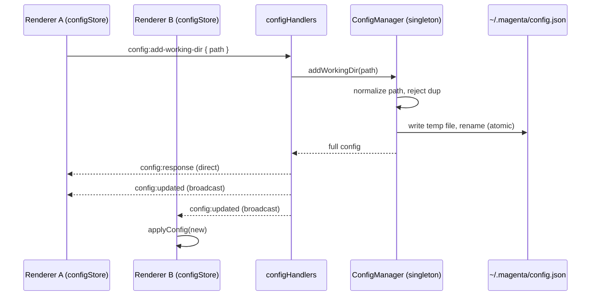

# Configuration & Settings

## Purpose

User-facing configuration lives in a single JSON file at `~/.magenta/config.json`, validated on load with Zod, edited through the Settings dialog, and kept in sync with the renderer over IPC. The config covers the working-directory allowlist (which doubles as a path-guard allowlist for file operations), the Specify install command template, sync intervals for the spec and session syncers, and a fallback approver name.

## User-visible surface

`SettingsDialog.tsx` hosts the settings surface. It composes:

- `WorkingDirList.tsx` — the current list of working dirs, one row per entry, with a remove button.
- `AddWorkingDirButton.tsx` — opens the native directory picker and appends the chosen directory.
- `SpecifyCommandSetting.tsx` — text input for the `specifyCommand` template (uses `{agent}` as the placeholder for the chosen AI), with a reset-to-default button.
- `SyncIntervalSettings.tsx` — separate number inputs for `specSyncIntervalMinutes` and `sessionSyncIntervalMinutes` (both 1–1440).

Validation errors bubble up into the dialog header as a red banner.

## IPC contract

| Direction | Type | Payload |
|-----------|------|---------|
| Request | `config:get` | — |
| Request | `config:add-working-dir` | `{ path }` |
| Request | `config:remove-working-dir` | `{ path }` |
| Request | `config:update` | `{ config: Partial<MagentaConfig> }` |
| Response | `config:response` | `{ config }` |
| Push | `config:updated` | `{ config }` (broadcast after any write) |

`MagentaConfigSchema.partial()` is used for `config:update` so the renderer can only touch canonical keys — arbitrary keys are rejected at the IPC boundary.

## Daemon

- `packages/daemon/src/config/ConfigManager.ts` — singleton (`getInstance()`) that owns `~/.magenta/config.json`. Methods: `getConfig`, `addWorkingDir`, `removeWorkingDir`, `updateConfig`. Paths are normalised (`~/` expanded, relative resolved to absolute) before being persisted. Writes go through a temp-file-then-rename so a crash mid-write cannot corrupt the file.
- `packages/daemon/src/ipc/handlers/configHandlers.ts` — thin IPC adapters. After any successful mutation the handler emits a `config:updated` broadcast so every open renderer tab stays in sync.

## Renderer

- `packages/ui/src/renderer/store/configStore.ts` — Zustand store exposing the current config plus the mutations (`fetchConfig`, `addWorkingDir`, `removeWorkingDir`, `updateSpecifyCommand`, `updateSpecSyncInterval`, `updateSessionSyncInterval`, `updateFallbackApproverName`). Each mutation calls `sendOrThrow` and updates local state on success. Subscribes to `config:updated` so multi-window changes propagate.
- Components under `packages/ui/src/renderer/components/settings/` (see above).

## Data model

`MagentaConfig` (schema in `packages/shared/src/config.ts`):

| Field | Default | Notes |
|-------|---------|-------|
| `workingDirs` | `[]` | Absolute paths; doubles as the file-read/write allowlist. |
| `specifyCommand` | `uvx --from git+https://github.com/github/spec-kit.git specify init --here --ai {agent} --force` | `{agent}` is substituted at runtime. |
| `specSyncIntervalMinutes` | `15` | 1–1440. |
| `sessionSyncIntervalMinutes` | `15` | 1–1440. |
| `fallbackApproverName` | `""` | Used when the git identity has no name and the approval flow has no override. |

Persisted at `~/.magenta/config.json`. Invalid JSON or schema-mismatch on load resets the file to defaults (existing usable values are not recovered).

## Flows

### Update + multi-window broadcast

### Bootstrap

`configStore.fetchConfig()` fires `config:get`, which reads the JSON file (or writes defaults if missing), validates with Zod, and returns. The store applies the result via `applyConfig`.

### Add a working dir

1. User clicks `AddWorkingDirButton`. The native directory picker opens.
2. On confirm, `configStore.addWorkingDir(path)` sends `config:add-working-dir`.
3. `ConfigManager.addWorkingDir` normalises the path, rejects duplicates (`includes()` check), appends, and writes the file atomically.
4. The handler emits `config:updated`, which every renderer subscribes to. All open windows refresh their local copy.

### Update the Specify command

`SpecifyCommandSetting` auto-saves via `configStore.updateSpecifyCommand`, which dispatches a `config:update` with a partial config containing only `{ specifyCommand }`. The Zod partial schema guarantees only canonical keys are persisted.

### Read the config from anywhere in the daemon

Consumers that need a value call `ConfigManager.getInstance().getConfig()`. The singleton is the single source of truth; writes go through `updateConfig` which re-validates.

## Guardrails

- Path normalisation: `~/` expands to `os.homedir()`; relative paths resolve to absolute before persisting. This prevents the allowlist from drifting depending on the daemon's cwd.
- Atomic writes: `ConfigManager` writes to `<path>.tmp` and renames, so a crash mid-write cannot leave a partial file behind.
- Zod clamping: `specSyncIntervalMinutes` and `sessionSyncIntervalMinutes` are clamped to `[1, 1440]`. A value of 0 is explicitly rejected (see the synced-sessions doc — a value of 0 disables the recurring timer, but that is only honoured at the scheduler level, not persisted to the config).
- `config:update` uses `MagentaConfigSchema.partial()`, blocking arbitrary keys from being smuggled into the file via the IPC boundary.
- Duplicate working dirs are rejected before append.

## Notes

- `ConfigManager` is a singleton; multiple `getInstance()` calls return the same object. That means in-process writes are atomic, but if an external process edits `~/.magenta/config.json` at runtime the daemon will not notice until the next explicit reload. The `config:updated` broadcast exists specifically to keep multi-window IDEs in sync; it is not a file watcher.
- `specifyCommand` is interpolated by the onboarding flow, not by `ConfigManager`. The template can include whitespace; it is split into argv at spawn time.
- `fallbackApproverName` is consumed by the spec-pipeline approval flow when the local `git config user.name` is empty.
- The dialog allows width-related customisation only through the size of `SettingsDialog` itself (500 px wide). There is currently no keyboard shortcut to open it; users open it from the ActivityBar's settings icon.
