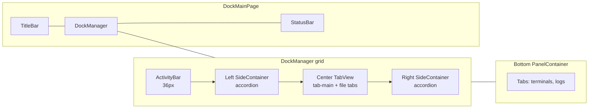
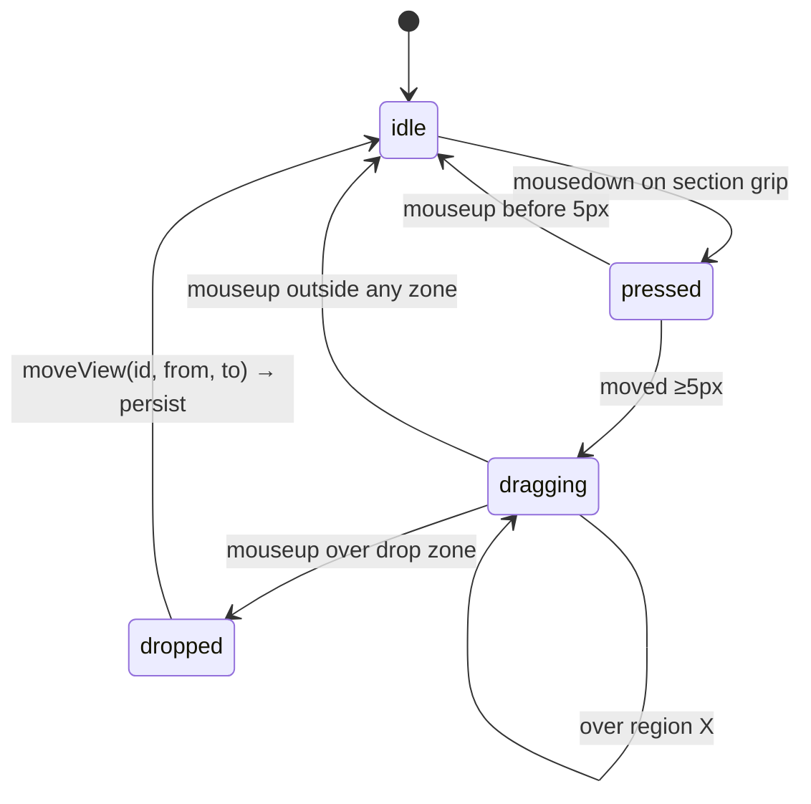

# Dock Layout

## Purpose

The dock is the UI shell: an ActivityBar, collapsible left and right sidebars with accordion sections, a center tabbed area, and a bottom panel. Every feature in the app is mounted as a "view" in one of those regions via a central registry. Users can drag views between regions, resize, toggle sidebars, and open per-view tabs. The layout is fully client-side; it persists to `localStorage` and migrates older formats on load.

## User-visible surface

The ActivityBar (36 px) sits on the far left and lists view groups. Three groups ship today:

- `explorer` — the repo and spec tree (left) plus spec files and repo changes (right).
- `markdown-manager` — the markdown file tree (left).
- `git` — the five Git-Management sidebar views (left).

Clicking a group icon switches the sidebar to that group's views. A dedicated Settings icon sits at the bottom of the bar.

The left `SideContainer` (default 280 px, min 180 px, max 40 % of the window) and the right `SideContainer` (default 260 px) each render an accordion of sections; each section has its own header with an optional search affordance and a drag grip. The center `TabView` hosts a pinned `tab-main` plus whatever file or tool tabs the user opened. The bottom `PanelContainer` is collapsed by default (200 px when open, min 70 px, max 60 %) and renders tabs when there are any to show — typically terminals and log views.

Keyboard shortcuts (global, handled in `useKeyboardShortcuts.ts`):

- `Cmd/Ctrl+B` toggles the left sidebar.
- `Cmd/Ctrl+Alt+B` toggles the right sidebar.
- `Cmd/Ctrl+J` toggles the bottom panel.
- `Cmd/Ctrl+\` resets the layout.

## IPC contract

None. Dock state is purely client-side.

## Daemon

Not involved.

## Renderer

Everything lives under `packages/ui/src/renderer/components/dock/`:

- `layoutStore.ts` — the Zustand store backing the entire layout. `LayoutTree` holds `{ left, right, bottom, center, activityBar }`. Auto-persistence runs through `requestIdleCallback` to `localStorage` under the key `magenta:dock-layout`, and includes several migrations for older formats (old built-in tabs collapse into the single `tab-main`; old flat bars collapse into groups; newly added git sections are injected).
- `ViewRegistry.ts` — the singleton `viewId → ViewDescriptor` map. Views are registered at startup by `registerViews.tsx`; containers fetch by id and render.
- `DockManager.tsx` — root component that orchestrates layout and delegates drag to `DragOverlay`.
- `ActivityBar.tsx` — icon rail.
- `SideContainer.tsx` — left/right accordion container.
- `AccordionSection.tsx` — collapsible section with optional inline search.
- `TabView.tsx` / `DockTabBar.tsx` — center tabbed area and its tab bar.
- `PanelContainer.tsx` — bottom panel.
- `ResizeHandle.tsx` — draggable handle used for region sizing.
- `DragOverlay.tsx` + `useDockDrag.ts` — the drag state machine for moving views between regions. Drag threshold is 5 px.
- `useKeyboardShortcuts.ts` — global shortcut handler.
- `StatusBar.tsx` — the thin bar along the bottom edge of the shell.
- `types.ts` — `ViewDescriptor`, `LayoutTree`, `TabState`, `SectionState`, `ActivityBarGroup`.

The dock is hosted by `packages/ui/src/renderer/pages/DockMainPage.tsx`, which sits inside `components/layouts/MainLayout.tsx`. The title bar (`components/titlebar/TitleBar.tsx`) renders above the dock and hosts `BackgroundJobsPopover.tsx`.

## Layout regions



## Data model

`LayoutTree` persisted to `localStorage` under `magenta:dock-layout`:

```ts
{
  left: { width, collapsed, sections: [{ viewId, expanded, size }, …] },
  right: { width, collapsed, sections: […] },
  bottom: { height, collapsed, activeTabId, tabs: [{ tabId, viewId, props?, title?, iconKey? }, …] },
  center: { activeTabId, tabs: [{ tabId, viewId, props?, title?, iconKey? }, …] },
  activityBar: {
    visible,
    groups: [{ id, title, iconViewId, viewIds, rightViewIds }],
    activeGroupId,
  },
}
```

Default layout (from `layoutStore.ts`):

- Left: `repos`, `specs`, `md-file-tree`, `git-repos`, `git-file-tree`, `git-changes`, `git-branches`, `git-history`.
- Right: `spec-files`, `repo-changes`.
- Bottom: empty, collapsed.
- Center: `tab-main` pinned, starts on `specs-list`.
- Activity groups: explorer / markdown-manager / git.

## Flows

### Drag a view between regions



### Startup

`loadPersistedLayout()` reads `localStorage`, applies five-plus migrations (old per-built-in tabs → single `tab-main`; old flat activity → the grouped variant with `spec-files` / `repo-changes` on the right; older markdown-manager structures → current; newly introduced git sections injected if missing), and hands the result to the Zustand store.

### Drag an accordion section between regions

1. The user grips the section header. `useDockDrag.startDrag(viewId, region)` sets `isDragging` and records the origin region. A 5 px movement threshold must be crossed before drag begins.
2. `DragOverlay` renders drop zones over the other regions.
3. On drop, `moveView(viewId, fromRegion, toRegion)` reorganises the tree and the store auto-persists.

### Toggle sidebar

Clicking the ActivityBar icon for the currently active group toggles that side's `collapsed` flag. Clicking a different group switches the active group without collapsing. Keyboard shortcuts drive the same action.

### Open a tab

`openTab(region, tab)` appends to the region's `tabs` and sets `activeTabId`. If a tab with the same `tabId` already exists, the existing tab is activated instead of duplicated.

### Resize a region

`ResizeHandle` drags call `setRegionWidth` / `setRegionHeight`, which clamp against `MIN_SIDE_WIDTH = 180 px`, `MAX_SIDE_RATIO = 0.4`, `MIN_BOTTOM_HEIGHT = 70 px`, `MAX_BOTTOM_RATIO = 0.6`. Values are auto-persisted.

## Guardrails

- The bottom panel only renders when it has tabs. An empty panel collapses itself.
- Built-in view ids (`specs-list`, `workflow`, `worktrees`, `ai-sessions`) consolidate into a single pinned `tab-main` on load; older layouts that had each built-in as its own tab are migrated automatically.
- Keyboard handlers use the platform-correct modifier (`metaKey` on macOS, `ctrlKey` elsewhere) without an explicit platform check.
- Accordion sections default to semantic sizes; the layout store does not pretend those are absolute pixel guarantees.

## Notes

- ActivityBar groups are a "view bundle" concept: each group icon exposes a set of left-sidebar sections plus a set of right-sidebar sections. Swapping groups swaps both sides together.
- The layout store's migrations are the most load-bearing part of this code. Any change to built-in view ids needs a corresponding migration entry or older installs will lose their layout on upgrade.
- View props are carried as part of the `TabState` (`props?`), so feature code can open a tab with arbitrary payload (e.g. a specific file path). The `ViewRegistry` feeds those props to the component on render.
