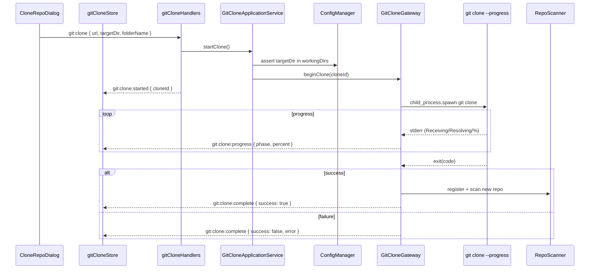
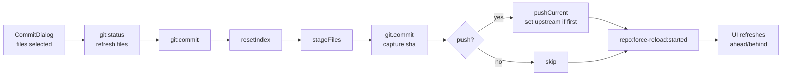

# Git Management

## Purpose

Git Management is the IDE's source-control surface. It consolidates every git capability the daemon exposes — clone, status/stage/commit, push/pull/fetch, branches, history, diff, blame, stash, remotes, reset, revert, and file-in-history reads — behind a dedicated activity-bar group called "Git Management". The activity group owns five left-sidebar views and a set of center tabs that overlap with dialogs for ad-hoc actions. Clone uses a background streaming job; every other operation is request/response and runs on `simple-git` (with `child_process` for clone progress).

See the separate [worktrees.md](./worktrees.md) for the worktree subsystem, which lives under its own IPC namespace (`worktree:*`) but shares git infrastructure with this feature.

## User-visible surface

### Activity-bar group

`activityBar.groups.git` in `layoutStore.ts` declares five left-sidebar views:

| viewId | Component | Role |
|--------|-----------|------|
| `git-repos` | `Sidebar` (reused) | Repo picker for the active git context. |
| `git-file-tree` | `GitFileTree.tsx` | File tree for the active repo; opens files via `file:read`. |
| `git-changes` | `GitChangesView.tsx` | Working-tree changes with Commit / Fetch / Pull / Push buttons. |
| `git-branches` | `GitBranchList.tsx` | Branch list driven by `branch:list` / `branch:checkout` / `branch:create`. |
| `git-history` | `HistorySidebar.tsx` | Commit log sidebar. |

Center tabs registered in `registerViews.tsx` include `CommitComposerTab.tsx`, `HistoryTab.tsx`, `RefDiffViewer.tsx`, and `BlameTab.tsx`. The activity panel (right-side) hosts `RepoFileChanges.tsx`, which auto-refreshes every 60 s and is reused by the worktree status view.

### Dialogs

| Dialog | Purpose |
|--------|---------|
| `CloneRepoDialog.tsx` | Clone into an allowlisted working dir; shows streaming progress. |
| `CommitDialog.tsx` | Select files + write a message; optional push. |
| `BranchSwitcherDialog.tsx` | Searchable branch checkout. |
| `CreateBranchOrWorktreeDialog.tsx` | Create a new branch or a new worktree from one control. |
| `ResetConfirmDialog.tsx` | Hard reset confirmation (requires typing "HARD"). |
| `StashDialog.tsx` | List, push, pop, apply, drop, show. |
| `RemoteDialog.tsx` | Add / rename / remove / set-url. |

## IPC contract

All types from `packages/shared/src/ipc.ts`. Grouped by capability.

### Clone (async, streaming)

| Direction | Type | Payload |
|-----------|------|---------|
| Request | `git:clone` | `{ url, targetDir, folderName, depth? }` |
| Response | `git:clone:started` | `{ cloneId, targetPath }` |
| Push | `git:clone:progress` | `{ cloneId, phase, percent, data }` |
| Push | `git:clone:complete` | `{ cloneId, repoPath, success, error? }` |

`folderName` matches `^[A-Za-z0-9._\-]+$`; `targetDir` must be one of the configured working dirs.

### Status / Commit

| Direction | Type | Payload |
|-----------|------|---------|
| Request | `git:status` | `{ repoPath }` |
| Response | `git:status:result` | `{ repoPath, files, branch, ahead, behind, hasUpstream }` |
| Request | `git:commit` | `{ repoPath, message, files, push? }` |
| Response | `git:commit:result` | `{ repoPath, commitSha, pushed, message }` |

### Push / Pull / Fetch

| Direction | Type | Payload |
|-----------|------|---------|
| Request | `git:push` | `{ repoPath, remote?, branch?, force? }` |
| Response | `git:push:result` | — |
| Request | `git:pull` | `{ repoPath, remote?, branch? }` |
| Response | `git:pull:result` | `{ success, message, conflicts? }` |
| Request | `git:fetch` | `{ repoPath, remote? }` |
| Response | `git:fetch:result` | `{ success, message }` |

### Branches

| Direction | Type | Payload |
|-----------|------|---------|
| Request | `branch:list` | `{ repoPath }` |
| Response | `branch:list:result` | `{ branches, current }` |
| Request | `branch:checkout` | `{ repoPath, branch }` |
| Response | `branch:checkout:result` | — |
| Request | `branch:create` | `{ repoPath, branchName, startPoint? }` |
| Response | `branch:create:result` | — |
| Request | `branch:delete` | `{ repoPath, branch, force? }` |
| Response | `branch:delete:result` | — |
| Request | `branch:rename` | `{ repoPath, oldName, newName }` |
| Response | `branch:rename:result` | — |

### History / diff / blame

| Direction | Type | Payload |
|-----------|------|---------|
| Request | `git:log` | `{ repoPath, branch?, path?, limit (≤500), skip, search? }` |
| Response | `git:log:result` | `{ commits, hasMore }` |
| Request | `git:commit-detail` | `{ repoPath, sha (hex 4–40) }` |
| Response | `git:commit-detail:result` | `{ commit, files }` |
| Request | `git:diff` | `{ repoPath, fromRef?, toRef?, path }` |
| Response | `git:diff:result` | `{ oldContent?, newContent?, oldPath?, newPath?, isBinary }` |
| Request | `git:blame` | `{ repoPath, path, ref? }` |
| Response | `git:blame:result` | `{ repoPath, path, lines }` |

### Stash / remotes / reset / revert

| Direction | Type | Payload |
|-----------|------|---------|
| Request | `stash:list` / `stash:push` / `stash:pop` / `stash:apply` / `stash:drop` / `stash:show` | — / `{ message?, includeUntracked? }` / `{ index }` / … |
| Request | `remote:list` / `remote:add` / `remote:rename` / `remote:remove` / `remote:set-url` | — / `{ name, url }` / `{ oldName, newName }` / `{ name }` / `{ name, url }` |
| Request | `git:reset` | `{ repoPath, mode (soft/mixed/hard), ref, confirmHard? }` |
| Request | `git:revert` | `{ repoPath, sha, noCommit? }` |

Each has a corresponding `*:result` response declared in the schema.

### File access

| Direction | Type | Payload |
|-----------|------|---------|
| Request | `gitfile:read` | `{ repoPath, ref, relativePath }` — `ref` matches `^[A-Za-z0-9._/\-]+$`; `relativePath` rejects leading `/`, `..`, NUL |
| Response | `gitfile:read:result` | `{ filePath, content }` |
| Request | `git:ls-files` | `{ repoPath, pattern (≤200 chars), ref? }` |
| Response | `git:ls-files:result` | `{ files }` |
| Request | `git:user` | `{ repoPath }` |
| Response | `git:user:result` | `{ name, email }` |

## Daemon

Application services:

- `GitApplicationService.ts` — branch create, fetch/pull/push, status/commit, reset/revert, blame.
- `GitCloneApplicationService.ts` — clone kickoff, allowlist validation, streaming progress.
- `GitHistoryApplicationService.ts` — log, commit detail, diff. Pagination and search validation.
- `GitStashApplicationService.ts` — stash list/push/pop/apply/drop/show.
- `GitRemoteApplicationService.ts` — remote add/rename/remove/set-url, branch delete/rename.

Infrastructure gateways:

- `GitOperationsGateway.ts` — status, commit, reset, revert, push, pull, fetch (via `simple-git`).
- `GitCloneGateway.ts` — clone with stderr progress parsing (raw `child_process.spawn('git', ['clone', '--progress', …])`, not `simple-git`, so progress can be streamed).
- `GitHistoryGateway.ts` — log parsing (with pagination / search / path filter), commit detail, diff with rename detection and binary flag.
- `GitBlameGateway.ts` — per-line annotation.
- `GitStashRemoteGateway.ts` — stash operations plus remote/branch plumbing.
- `GitGateway.ts` — worktree operations (see [worktrees.md](./worktrees.md)).
- `SpecGitGateway.ts` — read-only helpers used by the spec pipeline.

Handlers live under `packages/daemon/src/ipc/handlers/` split into `gitCloneHandlers.ts`, `gitHistoryHandlers.ts`, `gitMetadataHandlers.ts`, `gitOperationHandlers.ts`.

## Renderer

- `packages/ui/src/renderer/store/gitCloneStore.ts` — `Map<cloneId, CloneState>` with progress + log; subscribes to `git:clone:progress` / `:complete` events.
- `packages/ui/src/renderer/store/gitHistoryStore.ts` — caches log / diff responses.
- Components under `packages/ui/src/renderer/components/git/` (see the activity group table above). `useCommitComposer.ts` is a shared hook powering both `CommitComposerTab` and `CommitDialog`.
- `packages/ui/src/renderer/components/activity/RepoFileChanges.tsx` — shared changes view used in the right activity panel and by the worktree status page.

## Flows

### Clone (streaming, async)

### Commit (request/response)

### Clone

1. `CloneRepoDialog` collects url, working dir (validated against `configStore.workingDirs`), folder name, optional depth, and sends `git:clone`.
2. The daemon validates `targetDir` is in the allowlist, generates a `cloneId`, and kicks off `GitCloneGateway` in the background. The response is immediate (`git:clone:started`).
3. `git clone --progress` is spawned; stderr is parsed for phase and percent. `git:clone:progress` events are pushed as the clone advances.
4. On completion `git:clone:complete` fires with success/error. On success the new repo is fed into the repo scanner for registration.

### Commit

1. `CommitDialog` shows the files from `git:status` as checkboxes. The user selects a subset and writes a message.
2. `git:commit` resets the index (to avoid stale staging), stages only the selected files with `git add -A --`, commits, and captures the sha.
3. If `push: true`, `pushCurrent` runs and sets the upstream on the first push.
4. A `repo:force-reload:started` event fires so the renderer refreshes ahead/behind counters.

### Branch switch

1. `BranchSwitcherDialog` loads `branch:list` and filters by search.
2. On select, `branch:checkout` runs; on success the dialog closes and the repo list is re-fetched to pick up the new branch.

### View history

1. `HistoryTab` paginates through `git:log` (limit capped at 500, `hasMore` tells the UI when to stop).
2. Clicking a commit fetches `git:commit-detail` for the file list and diff stats.
3. Clicking a file fetches `git:diff` with `{ fromRef, toRef, path }` — if the file is binary, `isBinary: true` is returned and the UI renders a stub instead of trying to show content.

## Guardrails

- Ref validation is strict: `^[A-Za-z0-9._/\-]+$`, max 200 chars. NUL and `..` segments are rejected in `relativePath`.
- Clone targets must be in the configured working-dirs allowlist (`GitCloneApplicationService.startClone`). `folderName` is regex-validated.
- Hard reset has two layers: the Zod schema requires `confirmHard: true`; the UI layer additionally requires the user to type "HARD" in `ResetConfirmDialog`.
- Error codes: `GIT_ERROR` wraps most operation failures; `VALIDATION_ERROR` is used for input checks; `GIT_UNSAFE_OPERATION` is surfaced for unconfirmed hard resets; `WORKTREE_CONFLICT` for branch-name derivation failures.
- Pull returns a `conflicts` array rather than throwing, so the UI can surface a conflict picker before prompting the user to resolve.
- Log pagination caps limit at 500 to avoid blocking the daemon on huge repos.

## Notes

- Clone is the only git capability that streams progress; every other operation is request/response.
- Commit + push each trigger `repo:force-reload:started` (commit because the tip moved, push because upstream metadata changed). That is how the UI's ahead/behind counters and spec sync stay in sync.
- Diff supports `oldPath` / `newPath` to reveal renames, and an `isBinary` flag to keep the viewer from trying to render non-text content.
- Blame returns the full file content alongside line-level attribution, letting the `BlameTab` render source and gutter in one pass.
- `GitStashRemoteGateway` groups stash and remote operations in one gateway because both are small and share a lot of plumbing with branch operations.
- `docs/features/git-manager-feature.md` is an implementation plan that preceded this feature doc. Read that for the design rationale; this doc describes what actually shipped.
