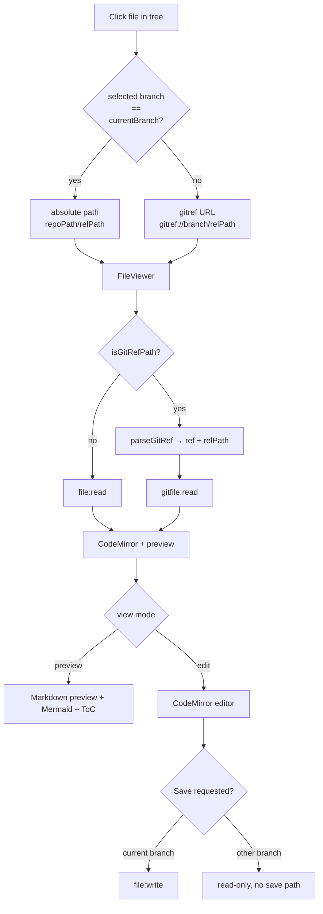

# Markdown Manager

## Purpose

The Markdown Manager is a dedicated activity-bar group for browsing, creating, editing, renaming, and deleting Markdown files across any branch of any registered repo. It is built on the same `file:*` / `dir:*` / `gitfile:read` / `git:ls-files` IPC endpoints the rest of the app uses, but it exposes them through a file-tree workflow scoped to `.md` files, with a picker for branch (so users can read docs on feature branches without checking them out), a CodeMirror editor, a rendered preview, a resizable Table-of-Contents panel, and inline Mermaid diagram rendering.

## User-visible surface

The `markdown-manager` activity group binds one left-sidebar section (`md-file-tree`). Opening a file from that tree appends a file tab to the center tab list, where `FileViewer` renders it.

- `MarkdownFileTree.tsx` — left view. A `DoublePicker` at the top selects repo (pinned first, then alphabetical) and branch. A search icon toggles an inline filter. The tree shows markdown files in hierarchy; context menu items allow New File / Rename / Delete, with inline input for name entry. A top-right `+` button creates a new file when the user is on the current branch.
- `FileViewer.tsx` — center tab. Holds a view-mode toggle (Preview / Edit), the Markdown preview (with Mermaid hook), the CodeMirror editor, the Approve control, and the Table-of-Contents panel.
- `MarkdownTableOfContents.tsx` — right-side ToC showing h1–h6, clickable for smooth-scroll. Tracks the active heading on scroll.
- `MermaidDiagram.tsx` — renders ` ```mermaid ` code blocks in-preview via `mermaid.js`.

## IPC contract

Markdown Manager is a consumer of generic file and git endpoints:

| Direction | Type | Payload |
|-----------|------|---------|
| Request | `file:read` | `{ filePath }` |
| Request | `file:write` | `{ filePath, content }` |
| Request | `file:delete` | `{ filePath }` |
| Request | `file:rename` | `{ oldPath, newPath }` |
| Request | `dir:list` | `{ dirPath }` |
| Request | `git:ls-files` | `{ repoPath, pattern, ref? }` — used with `pattern: '*.md'` and `ref: <branch>` to list markdown on a branch |
| Request | `gitfile:read` | `{ repoPath, ref, relativePath }` — used to read files on non-current branches via `gitref://` URLs |
| Request | `worktree:branches` | `{ repoPath }` — populates the branch dropdown |

## Daemon

- `packages/daemon/src/ipc/handlers/fileHandlers.ts` — adapters for `file:read`, `file:write`, `file:delete`, `file:rename`, `dir:list`, `file:create`, `dir:create`.
- `packages/daemon/src/infrastructure/FileSystemGateway.ts` — the enforcement layer. Every operation resolves against the user's `workingDirs` allowlist via `pathGuard`; file reads cap at 2 MB; rename fails if the destination exists; delete rejects directories.
- `packages/daemon/src/ipc/handlers/specHandlers.ts` hosts `gitfile:read`, which `SpecGitGateway.gitShow` backs.

## Renderer

- `packages/ui/src/renderer/store/markdownManagerStore.ts` — `selectedRepoPath`, `selectedBranch`, `branches`, `currentBranch`, `mdFiles`. Actions: `selectRepo`, `selectBranch`, `fetchBranches`, `fetchMdFiles`, `refreshFiles`. Persists `{ selectedRepoPath, selectedBranch }` to `localStorage` under `magenta:markdown-manager`.
- `packages/ui/src/renderer/components/sidebar/MarkdownFileTree.tsx` — the tree view, inline rename/new-file inputs, context menu, filter.
- `packages/ui/src/renderer/components/sidebar/DirectoryTree.tsx` — generic tree primitive used by the markdown file tree.
- `packages/ui/src/renderer/components/main/FileViewer.tsx` — tab content. Handles both absolute paths (for the current branch) and `gitref://` URLs (for other branches).
- `packages/ui/src/renderer/components/main/MarkdownTableOfContents.tsx` — right ToC.
- `packages/ui/src/renderer/components/main/MermaidDiagram.tsx` — Mermaid rendering with an error boundary.
- `packages/ui/src/renderer/components/main/fileViewerUtils.ts` — `extractHeadings`, `isGitRefPath`, `parseGitRef`, `isMarkdownFile`, `slugify`, `getFileName`.

## Data model

- `localStorage` key `magenta:markdown-manager` persists `{ selectedRepoPath, selectedBranch }`.
- File tree is a flat array of relative paths (e.g. `docs/README.md`) that the component turns into a nested `TreeEntry[]` via `buildFromFlat` + `sortEntries` + `filterTree`.
- Headings are extracted at render time with a regex scan for h1–h6 Markdown syntax. They are slugified (lowercase, spaces → hyphens) for anchor ids.
- On non-current branches, files are addressed as `gitref://<branch>/<relativePath>`. `parseGitRef` splits this into `{ ref, relativePath }` for `gitfile:read`.

## Flows

### Open-a-file decision



### Bootstrap

`MarkdownFileTree` mounts, reads persisted `{ selectedRepoPath, selectedBranch }`. If nothing is persisted but the Explorer has an active repo, the store auto-selects that repo so the two stays in sync. `fetchBranches(repoPath)` populates the branch dropdown via `worktree:branches`; `fetchMdFiles(repoPath, branch)` populates the file list via `git:ls-files` with `pattern: '*.md'` and `ref: branch`.

### Select a branch

`selectBranch(branch)` persists to `localStorage` and re-runs `fetchMdFiles`. If the selected branch no longer exists (e.g. user deleted it externally), the store falls back to `currentBranch`.

### Open a file

Clicking a file in the tree fires `onOpenFile`. If the selected branch matches `currentBranch`, the handler opens the absolute path (`<repoPath>/<filePath>`); otherwise it opens a `gitref://<branch>/<relativePath>` URL. `FileViewer` distinguishes the two via `isGitRefPath`: absolute paths go through `file:read`, gitref URLs go through `gitfile:read`.

### Edit and save (current branch only)

In edit mode the CodeMirror editor drives the buffer. On save, `file:write` persists the content, and `markdownManagerStore.refreshFiles` re-fetches the tree. File tabs on non-current branches are read-only — there is no Save path because `file:write` would target the working tree, not the branch.

### Create a file

The `+` button or "New File" context menu opens an inline input. On confirm the handler calls `file:write` with the new path and empty content, refreshes the list, and activates the tab for the new file.

### Rename a file

The Rename context menu opens an inline input pre-filled with the filename (selection excludes the extension for easier editing). On confirm `file:rename` runs; `refreshFiles` follows.

### Delete a file

`file:delete` with a confirmation dialog; the tab closes automatically if it was open.

### Approve

The Approve button writes a structured marker into the file (used by the spec-pipeline approval flow). See [`spec-pipeline.md`](./spec-pipeline.md) for details.

## Guardrails

- Every `file:*` operation runs through `FileSystemGateway.resolveAllowed`, which rejects paths outside the user's `workingDirs` or the system-safe roots (`~/.magenta`, `~/.specify`, `os.tmpdir()`).
- Reads cap at 2 MB.
- `readFile` / `deleteFile` refuse directories.
- `renameFile` refuses to overwrite an existing destination.
- `gitref://` parsing honours the same ref regex as the `gitfile:read` IPC (`^[A-Za-z0-9._/\-]+$`). Relative paths cannot start with `/`, cannot contain `..`, and cannot include NUL.
- `git:ls-files` caps the pattern at 200 characters.
- The tree filter is a case-insensitive substring search over filenames only; parent directories are shown when any child matches.
- On non-current branches the tree hides the `+` button and the context menu does not offer Rename or Delete — those operations would write to the working tree, not the branch.

## Notes

- The `gitref://` protocol is non-standard. It is resolved in the renderer, not by any URL handler — `FileViewer` explicitly checks `isGitRefPath` and routes through `gitfile:read`. This lets the same viewer render live editable files and historical read-only files without branching the render tree.
- Mermaid handling lives inside the preview renderer's `components.code` override in `FileViewer`, so regular fenced code blocks render as normal `<code>` while ` ```mermaid ` blocks go to `MermaidDiagram`.
- Auto-sync with Explorer is one-way: the markdown manager adopts the Explorer's active repo if it has no persisted selection. Once the user makes an explicit choice it stays put.
- `useActiveHeading` in the ToC component tracks scroll with an 80 px top offset so the highlighted heading matches what the user actually sees (headings disappear under the editor toolbar otherwise).
