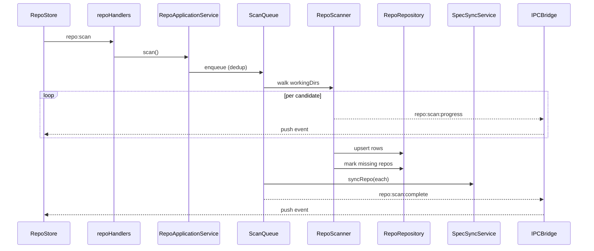
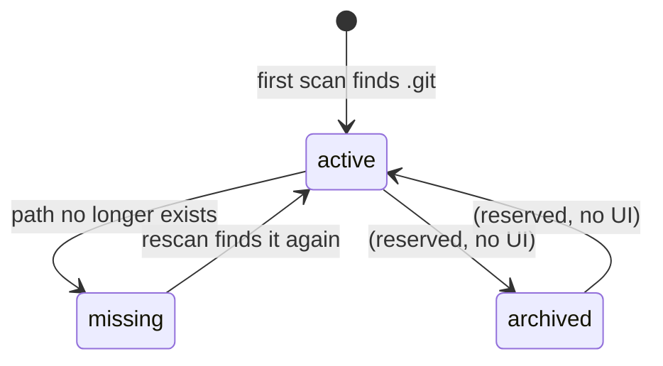

# Repository Management

## Purpose

Magenta IDE is multi-repo first. The Repository feature discovers local git repos inside user-configured working directories, keeps them indexed in SQLite with branch and spec-detection metadata, surfaces them in the left sidebar, and tracks which one is currently active across the rest of the UI. A repo has a status lifecycle (`active` / `missing` / `archived`) so that repos removed from disk do not silently disappear from history.

## User-visible surface

The Explorer activity group contains the repo surface. The left sidebar's `Repos` accordion section renders `RepoList`, which groups entries into pinned and unpinned rows and supports inline search over name, branch, and path. Each row is a `RepoItem` showing the repo name, current branch, and a pin toggle. Repos whose on-disk status is `missing` are filtered out of the list but remain in the database.

Repo actions surface through a toolbar scan button (triggers `repo:scan`) and a per-repo force-reload option that re-reads a single repo without rescanning everything.

Primary components:

- `packages/ui/src/renderer/components/sidebar/Sidebar.tsx` — host for the repo list and its search bar.
- `packages/ui/src/renderer/components/sidebar/RepoList.tsx` — pinned/unpinned groupings, filter logic.
- `packages/ui/src/renderer/components/sidebar/RepoItem.tsx` — row UI.

## IPC contract

All types are defined in `packages/shared/src/ipc.ts`.

| Direction | Type | Payload |
|-----------|------|---------|
| Request | `repo:list` | — |
| Request | `repo:scan` | — |
| Request | `repo:force-reload` | `{ repoPath }` |
| Request | `branch:list` | `{ repoPath }` |
| Request | `branch:checkout` | `{ repoPath, branch }` |
| Push | `repo:scan:started` | — |
| Push | `repo:scan:progress` | `{ scanned, total, currentDir }` |
| Push | `repo:scan:complete` | `{ repos, added, updated, missing }` |
| Push | `repo:force-reload:started` | `{ repoPath }` |

`Repository` (the schema returned to the renderer) is defined in the same file as `{ id, name, path, branch, hasSpecs, specCount, status, scannedAt, createdAt }` with status drawn from the `REPO_STATUSES` constant.

## Daemon

- `packages/daemon/src/application/RepoApplicationService.ts` — orchestrates list, scan, branch ops, and force-reload. Thin layer over the repository and scanner.
- `packages/daemon/src/services/RepoRepository.ts` — CRUD over the `repos` table with an atomic upsert that preserves `id` and `createdAt`.
- `packages/daemon/src/services/RepoScanner.ts` — filesystem walker. Default depth 3, skips `node_modules`, `dist`, `build`, `.next`, `.nuxt`, and `.git`. For each `.git` it finds, it reads the current branch and detects a `specs/` directory to set `hasSpecs`.
- `packages/daemon/src/services/ScanQueue.ts` — deduplicates scan jobs via `BackgroundJobManager`, emits `repo:scan:progress` / `:complete` over the IPC bridge, and triggers `SpecSyncService` after a successful scan.
- `packages/daemon/src/services/DirWatcher.ts` — chokidar watcher over the configured working directories. Debounces 2s, triggers a rescan when a `.git` directory appears or a repo directory is removed.
- `packages/daemon/src/ipc/handlers/repoHandlers.ts` — thin IPC adapters registered in `registerHandlers.ts`.

Wiring lives in `DaemonContainer.ts`: scanner → scan queue (with job manager + bridge) → dir watcher → repo application service.

## Renderer

- `packages/ui/src/renderer/store/repoStore.ts` — Zustand store holding `repos[]`, `activeRepoPath`, `pinnedPaths` (a `Set<string>` persisted to `localStorage` under `magenta:pinned-repos`), `isScanning`, and `scanProgress`. It initialises subscriptions to the `repo:scan:*` push events.
- `packages/ui/src/renderer/services/SessionCoordinator.ts` — the cross-store coordinator. `selectRepo(path)` is the single entry point that updates `repoStore` plus `sessionStore` atomically so the rest of the UI sees a consistent active-repo selection.

## Data model

Two tables back this feature in SQLite (see `packages/daemon/src/db/schema.ts` and migrations `0001` / `0004`):

`repos`:

| Column | Type | Notes |
|--------|------|-------|
| `id` | TEXT PK | ULID |
| `name` | TEXT | |
| `path` | TEXT UNIQUE | absolute path |
| `branch` | TEXT | last known current branch |
| `has_specs` | INTEGER | 0/1 |
| `spec_count` | INTEGER | |
| `status` | TEXT | `active` / `missing` / `archived` |
| `scanned_at` | INTEGER | epoch ms |
| `created_at` | INTEGER | epoch ms |

`working_dirs`:

| Column | Type | Notes |
|--------|------|-------|
| `id` | TEXT PK | ULID |
| `path` | TEXT UNIQUE | allowlisted scan root (also used as the path-guard allowlist for file reads) |

Booleans are stored as 0/1 and converted by the `repoMapper` on the infrastructure side (`packages/daemon/src/infrastructure/mappers/`). Pinned state is client-only and lives in `localStorage`.

## Flows

### Repo status lifecycle

### Initial scan

1. The user clicks the scan button, or `DirWatcher` detects a relevant change. `ScanQueue` enqueues a deduplicated job through `BackgroundJobManager` so overlapping requests collapse.
2. `RepoScanner` walks every configured working directory up to depth 3. For each `.git` it finds, it records a candidate with its branch and `hasSpecs` flag.
3. Progress is emitted as `repo:scan:progress` events with `{ scanned, total, currentDir }`.
4. On completion the scanner upserts into `repos`, marks any previously known repo no longer present as `missing`, and flushes.
5. `SpecSyncService` is triggered for each repo that passed scanning; the completed scan emits `repo:scan:complete` with counts of `added`, `updated`, and `missing`.

### Force-reload a single repo

1. The user triggers `repo:force-reload` for a single repo. `BackgroundJobManager` enqueues a named job (`Reload: <name>`).
2. The scanner rescans only that path, updating branch, `hasSpecs`, and status. If the path is gone the row flips to `missing`.
3. `SpecSyncService.syncRepo` refreshes the spec tree for that repo on whatever branch is now current.
4. A `repo:force-reload:started` event is pushed so the renderer can show transient progress.

### Branch checkout

`branch:checkout` runs through `simple-git` inside the scanner. On success the `repos` row is updated with the new branch and `scannedAt`, and `SpecSyncService.syncRepo` is called so the spec tree reflects the new branch.

## Guardrails

- Scan walking is constrained to the `working_dirs` allowlist and depth 3. Paths outside that allowlist are rejected upstream via `pathGuard.ts`.
- `DirWatcher` debounces for 2 seconds to avoid thrashing on bulk file operations like `git checkout` into large repos.
- `ScanQueue` collapses concurrent `repo:scan` requests into a single job rather than running them sequentially.
- Repo `path` is `UNIQUE` in SQLite; the upsert path checks existing before insert to preserve `id` and `createdAt`.
- Removed repos are soft-kept: they flip to `status = 'missing'` rather than being deleted, so history (specs, worktrees, synced sessions referencing them) still resolves. The UI filters them out of the sidebar.

## Notes

- `archived` is a valid `REPO_STATUSES` value but there is no UI that transitions a repo into it today. It is reserved for a future "hide without deleting" flow.
- `hasSpecs` is a coarse boolean set during the filesystem walk. The full spec tree is not read at scan time — that work is lazy, performed by `SpecSyncService` and `SpecReader` the first time a repo is selected or on the recurring spec sync interval.
- Session state (`selectedRepoPath`, `selectedSpecPath`, sidebar widths, etc.) is no longer stored in the `session_state` table even though the table remains in the schema — it is persisted in the renderer via `localStorage`. This is called out in `ipc.ts`.
