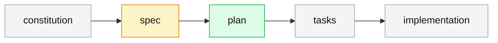
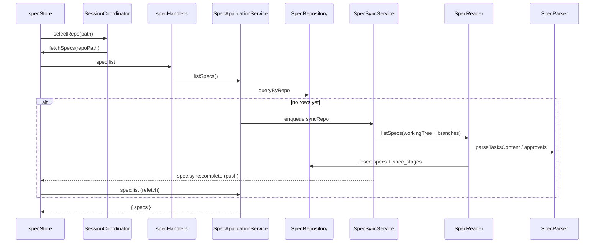

# Spec-Driven Pipeline

## Purpose

The spec pipeline is the core workflow Magenta IDE orchestrates. Every repo that has been onboarded with Spec Kit (see [`onboarding.md`](./onboarding.md)) holds one or more "specs" — folders under `specs/` that progress through five stages: **constitution → spec → plan → tasks → implementation**. The daemon syncs specs (including specs that live on branches other than the current one) into SQLite, parses stage metadata (task counts, implementation progress, approval stamps) from the markdown files, and the renderer surfaces that state as a spec tree with stage dots and a React Flow workflow diagram. Approval is a file write with a structured marker; the sync job picks it up and metadata updates.

## User-visible surface

The Explorer activity group exposes two spec surfaces:

- The **Specs** accordion section in the left sidebar renders `SpecTree`, listing specs grouped by branch. Each row is a `SpecItem` showing the spec name and a `StageDots` component — five coloured dots in pipeline order. Dot colour follows the project-wide workflow palette: outline for missing/pending, blue for draft/review-in-progress, yellow for awaiting review, green for approved/done.
- The **Workflow** center tab renders `WorkflowView`, which hosts a React Flow canvas (`FlowDiagram` + `PipelineNode`) showing the five stages connected by edges. Nodes link to their source files and expose an inline "Approve" button on hover. The `ApproveButton` writes an approval marker into the stage file; if the local git identity is missing the UI prompts `ApproverNameDialog` for a name first.

Primary components:

- `packages/ui/src/renderer/components/sidebar/SpecTree.tsx`, `SpecItem.tsx`, `StageDots.tsx`
- `packages/ui/src/renderer/components/main/WorkflowView.tsx`, `ApproveButton.tsx`, `SpecsListView.tsx`
- `packages/ui/src/renderer/components/flow/FlowDiagram.tsx`, `PipelineNode.tsx`, `diagramUtils.ts`, `nodeTypes.ts`
- `packages/ui/src/renderer/components/dialogs/ApproverNameDialog.tsx`

## IPC contract

The pipeline's IPC surface is intentionally small — approval is implemented as a plain `file:write` into the stage file, and the parser does the rest on the next sync.

| Direction | Type | Payload |
|-----------|------|---------|
| Request | `spec:list` | `{ repoPath }` |
| Push | `spec:sync:started` | `{ repoPath }` |
| Push | `spec:sync:complete` | `{ repoPath, success, error? }` |

`SpecFolder` (returned in the list response) is `{ id, repoPath, name, path, branch, isCurrentBranch, stages[], files[], createdAt }`. `PipelineStage` is `{ name, status, filePath, metadata? }` where metadata can carry `taskCount`, `completedCount`, `worktreeCount`, `implementationProgress` (clamped to `[0,100]`), `approvedBy`, and `approvedAt`.

Shared constants live in `packages/shared/src/constants.ts`:

- `PIPELINE_STAGES = ["constitution", "spec", "plan", "tasks", "implementation"]`
- `STAGE_STATUSES = ["missing", "draft", "review", "approved", "idle", "running", "pending", "in-progress", "done"]`

## Daemon

- `packages/daemon/src/application/SpecApplicationService.ts` — `listSpecs` (triggers a background sync if the repo has no specs yet), `readGitFile` (via `SpecGitGateway`), `getGitUser`.
- `packages/daemon/src/services/SpecSyncService.ts` — scheduled sync runner. Interval is driven by `specSyncIntervalMinutes` in the config (default 15 minutes). Each tick enqueues a `syncAllRepos` job that loops active repos and calls `syncRepo` on each.
- `packages/daemon/src/services/SpecReader.ts` — the heavy lifter. Enumerates specs from the working tree and from every local branch via `git ls-tree` / `git show`, deduplicates by name (newest commit wins on non-current branches), and calls `SpecParser` for each stage file.
- `packages/daemon/src/services/SpecRepository.ts` — persistence. A single `LEFT JOIN` fetches specs together with their stages to avoid N+1 queries. Upserts happen inside a transaction covering both tables.
- `packages/daemon/src/domain/SpecParser.ts` — pure parsing: task counts from markdown checkboxes (`/^-\s+\[\s*[\sxX]\s*\]/gm`), approval markers (`**Approved by:** … | **Date:** …`), and implementation-progress derivation.
- `packages/daemon/src/domain/statusDetection.ts` — per-stage status rules applied over parser output.
- `packages/daemon/src/infrastructure/SpecGitGateway.ts` — read-only git helpers: `getCurrentBranch`, `listLocalBranches`, `gitListSpecDirs`, `getLatestCommitTimestamp`, `gitShow` for content on non-current branches.
- `packages/daemon/src/ipc/handlers/specHandlers.ts` — thin adapters for `spec:list`, `gitfile:read`, and `git:user`.

## Renderer

- `packages/ui/src/renderer/store/specStore.ts` — `specs[]`, `selectedSpecPath`, `currentRepoPath`, `isLoading` (only true on the first fetch for a repo), a `hasFetchedForRepo` guard, and subscriptions to `spec:sync:*` push events. `optimisticApproveStage` updates stage metadata locally before the next sync confirms.
- `packages/ui/src/renderer/services/SessionCoordinator.ts` — `selectSpec(path)` is the atomic cross-store update that sets the active spec in both `specStore` and `sessionStore` and validates the selection still exists after a sync.
- `packages/ui/src/renderer/hooks/useSortedSpecs.ts` — sort order for the sidebar (current branch first, then stable by name).

## Data model

Two tables back this feature (`packages/daemon/src/db/schema.ts`, migrations `0006` and `0013`):

`specs`:

| Column | Type | Notes |
|--------|------|-------|
| `id` | TEXT PK | ULID |
| `repo_id` | TEXT FK → `repos.id` | cascade delete |
| `name` | TEXT | spec folder name |
| `path` | TEXT | working-tree path |
| `branch` | TEXT | branch this spec was read from |
| `is_current_branch` | INTEGER | 0/1 |
| `files_json` | TEXT | JSON array of file paths |
| `synced_at` | INTEGER | epoch ms |
| `created_at` | INTEGER | epoch ms |

`UNIQUE (repo_id, branch, name)` keeps the same spec on different branches distinct.

`spec_stages`:

| Column | Type | Notes |
|--------|------|-------|
| `id` | TEXT PK | ULID |
| `spec_id` | TEXT FK → `specs.id` | cascade delete |
| `name` | TEXT | one of `PIPELINE_STAGES` |
| `status` | TEXT | one of `STAGE_STATUSES` |
| `file_path` | TEXT NULL | path to the stage file, or null if absent |
| `metadata_json` | TEXT NULL | JSON-serialised `PipelineStage.metadata` |

`UNIQUE (spec_id, name)` keeps exactly one row per stage per spec.

The `spec_cache` table from migration `0005` has been dropped; the `specs` and `spec_stages` pair replaced it.

## Flows

### Pipeline stages

Dot colours in the sidebar follow the same palette: grey for missing/pending, yellow for awaiting review, green for approved, blue for in-progress.

### First-time list for a repo

Step-by-step:

1. The user selects a repo. The renderer calls `specStore.fetchSpecs(repoPath)` which sets `isLoading=true` on first fetch for that repo.
2. A `spec:list` request hits `SpecApplicationService.listSpecs`, which queries the DB. If the repo has no spec rows yet, a background sync is enqueued.
3. The response returns whatever is currently in the DB (often empty on the very first call). The background sync completes asynchronously.
4. `spec:sync:complete` fires; the store re-fetches to pick up the now-populated stages. `isLoading` is cleared after the first fetch settles.

### Approving a stage

1. The user clicks `ApproveButton` on a stage node in `WorkflowView`. If the stage file lives on a non-current branch the UI may first create a worktree (see [`worktrees.md`](./worktrees.md)).
2. The button reads the stage file — either from the working tree via `file:read` or from a branch via `gitfile:read` — then prompts `ApproverNameDialog` if the local git identity is empty (and the config has no `fallbackApproverName`).
3. An approval line (`**Approved by:** <name> | **Date:** <ISO date>`) is stamped into the file and written back via `file:write`.
4. `specStore.optimisticApproveStage` updates the stage metadata locally. The next sync tick re-parses the file and confirms.

### Recurring sync

`SpecSyncService.start()` schedules an interval driven by `specSyncIntervalMinutes`. Each tick enqueues a `syncAllRepos` background job; per repo, `SpecReader` lists specs from the working tree and every local branch, dedupes, calls `SpecParser` for each stage file, and `SpecRepository` upserts inside a transaction. `spec:sync:complete` is pushed per repo so subscribed stores can react.

## Guardrails

- Spec deduplication uses `(repo_id, branch, name)` as the key. If the same spec exists on multiple branches, only the newest (by commit timestamp) is kept on non-current branches.
- Specs on non-current branches are exposed via a `gitref://<branch>/specs/<name>/<file>` virtual URL so the renderer can fetch them without checkout. The `gitfile:read` IPC enforces a strict ref regex (`^[A-Za-z0-9._/\-]+$`) and rejects `..` or NUL in the relative path.
- Approval parsing is strict: both the name and the date must be present. A file with just `**Approved by:**` and no date does not count as approved.
- `implementationProgress` is clamped to `[0,100]` before IPC serialisation to prevent Zod validation failures downstream.

## Notes

- There is no daemon-side `spec:approve` IPC. Approval is a plain `file:write`; the sync cycle is the authority on whether a stage counts as approved. The optimistic local update bridges the gap.
- `constitution` is listed in `PIPELINE_STAGES` but `SpecParser` has no dedicated logic for it — it is treated as a generic stage with a file path and status derived from existence only.
- The virtual `gitref://` protocol lets users read (and approve) spec stages that live on other branches without switching the working tree. The protocol is interpreted in the renderer (see `fileViewerUtils.parseGitRef`) and routed to `gitfile:read` rather than `file:read`.
- There is no enforced reviewer list or rejection flow. Approval is "who approved, when" and nothing more.
