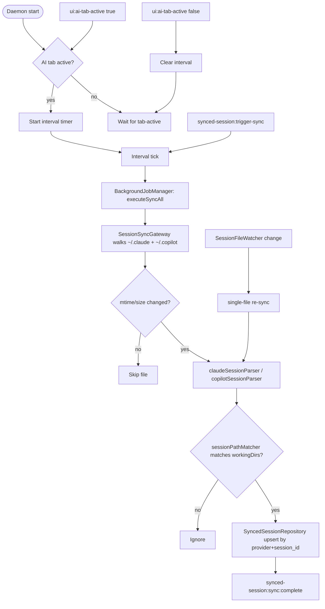

# Synced Sessions (Disk-Scanned CLI History)

## Purpose

Claude Code and GitHub Copilot CLI both persist per-session state on disk: Claude under `~/.claude/projects/<project>/*.jsonl`, Copilot under `~/.copilot/session-state/<session>/`. Magenta IDE's synced-sessions feature is a background scanner that parses those files, filters to sessions whose cwd lives inside a registered working directory, and indexes the result in SQLite so users see their full CLI history — not just sessions that were launched from inside the IDE. Because the data is disk-authoritative, the app can be restarted without losing history, and sessions started outside the app (plain `claude` in a terminal) appear in the same list as sessions started inside it.

## User-visible surface

Inside the AI activity tab, the `UnifiedSessionTree` blends live and synced sessions. Each row carries provider icon, title, message count, token usage, status, and an activity pill (`processing` / `idle` / `completed`). Rows are grouped by cwd/project and sorted newest-first within a group.

Context actions available on a synced row include "Resume Session" (which opens `NewSessionDialog` prefilled with the provider session id and hands off to the live-session flow), archive (soft-delete), and open-session-dir.

Pinning is implemented separately from group layout via `pinnedSessionsStore` so that user-pinned sessions float to the top across app restarts.

## IPC contract

| Direction | Type | Payload |
|-----------|------|---------|
| Request | `synced-session:list` | `{ provider? }` where provider is one of `SYNCED_SESSION_PROVIDERS` |
| Request | `synced-session:trigger-sync` | — |
| Request | `synced-session:archive` | `{ id }` |
| Request | `ui:ai-tab-active` | `{ active }` — renderer tells the daemon whether the AI tab is visible |
| Push | `synced-session:list:result` | `{ sessions }` |
| Push | `synced-session:sync:triggered` | — |
| Push | `synced-session:sync:complete` | `{ claudeCount, copilotCount }` |
| Push | `synced-session:archived` | `{ id }` |

`SYNCED_SESSION_PROVIDERS = ["claude-code", "copilot"]`. Note the namespace difference from live sessions (`AI_PROVIDERS = ["claude", "copilot"]`) — synced-session providers refer to the CLI tool that produced the JSONL, while live-session providers are the runtime targets.

## Daemon

- `packages/daemon/src/application/SessionSyncApplicationService.ts` — orchestrator. Runs on startup and on a recurring interval (default 15 minutes, driven by `sessionSyncIntervalMinutes`). Pauses the recurring tick when the AI tab is not active; a manual `trigger-sync` always runs.
- `packages/daemon/src/infrastructure/SessionSyncGateway.ts` — FS-facing gateway. Enumerates Claude and Copilot session files with mtime and size metadata.
- `packages/daemon/src/infrastructure/SessionFileWatcher.ts` — chokidar-based live watcher on both provider directories. On any JSONL/state change it enqueues a single-file re-sync so the list stays fresh.
- `packages/daemon/src/services/SyncedSessionRepository.ts` — SQLite CRUD for the `synced_sessions` table. Upsert keys on `(provider, session_id)`.
- `packages/daemon/src/domain/claudeSessionParser.ts` — pure JSONL parser. Extracts session id, cwd, branch, model, token counts, message count, title, subagent count, and activity.
- `packages/daemon/src/domain/copilotSessionParser.ts` — parses `events.jsonl` + `workspace.yaml` for Copilot sessions.
- `packages/daemon/src/domain/sessionPathMatcher.ts` — `isSessionPathRelevant(cwd, workingDirs, repos)` filters sessions to paths that live inside a registered working dir, repo, or worktree.
- `packages/daemon/src/ipc/handlers/syncedSessionHandlers.ts` — thin IPC adapters.

## Renderer

- `packages/ui/src/renderer/store/syncedSessionStore.ts` — holds the session list, computed groups (by cwd), `isLoading`, `error`, and a `subscriptionsReady` flag. Actions: `fetchSessions`, `triggerSync`, `archiveSession`, `initializeSubscriptions`.
- `packages/ui/src/renderer/store/pinnedSessionsStore.ts` — independent store for the pinned-session set, persisted to localStorage.

## Data model

`SyncedSessionRecord` (schema in `packages/shared/src/syncedSession.ts`):

| Field | Notes |
|-------|-------|
| `id` | Local DB PK (ULID-style). |
| `provider` | `claude-code` or `copilot`. |
| `sessionId` | The CLI's own UUID — the join key for live sessions. |
| `projectDir` | Claude parent-folder name; null for Copilot. |
| `cwd` | Working dir recorded by the CLI. |
| `gitBranch`, `model`, `tokenUsage` | Parsed from JSONL; `tokenUsage` is `{ inputTokens, outputTokens, cacheCreationInputTokens, cacheReadInputTokens }`. |
| `messageCount`, `subagentCount` | Claude tracks subagents; Copilot leaves that at 0. |
| `status` | `active` / `completed`. |
| `activity` | `processing` / `idle` / `completed`. Derived from the trailing events. |
| `slug`, `version`, `entrypoint`, `title` | Display metadata. |
| `syncedFilePath` | Absolute path to the source JSONL. Used for "Open session dir". |
| `startedAt`, `endedAt`, `createdAt` | ms epoch. |
| `isArchived` | Soft-delete flag. |

DB table `synced_sessions` (migrations `0012`, `0014`, `0015`):

| Column | Type | Notes |
|--------|------|-------|
| `id` | TEXT PK | |
| `provider` | TEXT | `claude-code` / `copilot` check constraint |
| `session_id` | TEXT | |
| `project_dir`, `cwd`, `git_branch`, `model` | TEXT nullable | |
| `token_usage_json` | TEXT | JSON string |
| `message_count`, `subagent_count` | INTEGER | |
| `status` | TEXT | default `completed` |
| `activity` | TEXT | default `idle` (added 0014) |
| `slug`, `version`, `entrypoint`, `title` | TEXT | |
| `synced_file_path` | TEXT UNIQUE | |
| `synced_file_mtime`, `synced_file_size` | INTEGER | incremental change detection |
| `started_at`, `ended_at`, `last_synced_at`, `created_at` | INTEGER | |
| `is_archived` | INTEGER | 0/1 (migration 0015) |

Indexes: `provider`, `cwd`, `started_at DESC`. The `(provider, session_id)` pair is unique.

## Flows

### Sync cycle

### Background sync cycle (steps)

1. On startup `SessionSyncApplicationService.start()` schedules the interval only if the AI tab has been reported active. If the tab was reported inactive, the schedule is deferred.
2. When the renderer sends `ui:ai-tab-active(true)` the daemon performs an immediate sync and starts the recurring timer. On `ui:ai-tab-active(false)` the timer is cleared.
3. Each tick enqueues a dedup-keyed `executeSyncAll` job through `BackgroundJobManager`.
4. `SessionSyncGateway` walks Claude's projects directory and Copilot's session-state directory. For each file whose `(mtime, size)` differs from the last scan, the appropriate parser runs.
5. `sessionPathMatcher.isSessionPathRelevant` filters out any session whose cwd is not inside a configured working directory, registered repo, or known worktree.
6. Matching rows are upserted; `synced-session:sync:complete` is pushed with the new/updated counts per provider.

### Live watcher

`SessionFileWatcher` observes both provider directories. On a JSONL append or new session file it triggers a single-file re-sync so the list picks up in-flight activity without waiting for the recurring tick.

### Resume a synced session

1. User clicks Resume on a synced row. The UI opens `NewSessionDialog` with `resumeContext = { providerSessionId, provider, branch }`.
2. On confirm, `ai-session:create` is sent with that `providerSessionId`; the live-session flow takes over (see [`ai-sessions.md`](./ai-sessions.md)).
3. From that point the live session and the synced row share a join key (`providerSessionId`), and the row updates its `activity` on the next sync tick.

### Archive

`synced-session:archive { id }` flips `is_archived` to 1. The renderer filters archived rows out by default but the data stays in the DB.

## Guardrails

- Path filtering: only sessions with a cwd that resolves inside a configured working dir, a registered repo path, or a known worktree are kept. Orphan sessions (e.g. from scratch directories) are ignored.
- Incremental scan: the gateway skips files whose mtime/size is unchanged since the last tick.
- Activity inference is a derived field, not one written by the CLI. The parser uses the trailing events — a pending user message means `processing`, a trailing assistant message means `idle`, a `last-prompt` event means `completed`.
- If `sessionSyncIntervalMinutes` is set to 0 in config, the recurring timer is disabled entirely and only manual `trigger-sync` calls run.
- Archive is always a soft-delete; there is no DB row deletion path on the handler side.

## Notes

- Tokens are persisted as JSON text in `token_usage_json`. The renderer parses on demand.
- Synced rows are never updated by live-session state. If the user changes permission mode in a live session, the synced row is refreshed only on the next sync tick (when the parser re-reads the JSONL).
- Claude can have a `sessionId/subagents/` subdirectory with more JSONL files representing parallel agent work; `subagent_count` reflects those.
- The `SYNCED_SESSION_PROVIDERS` naming (`claude-code`, not `claude`) reflects the CLI tool that produced the file — keep that in mind when joining across tables, since live records use `claude`.
