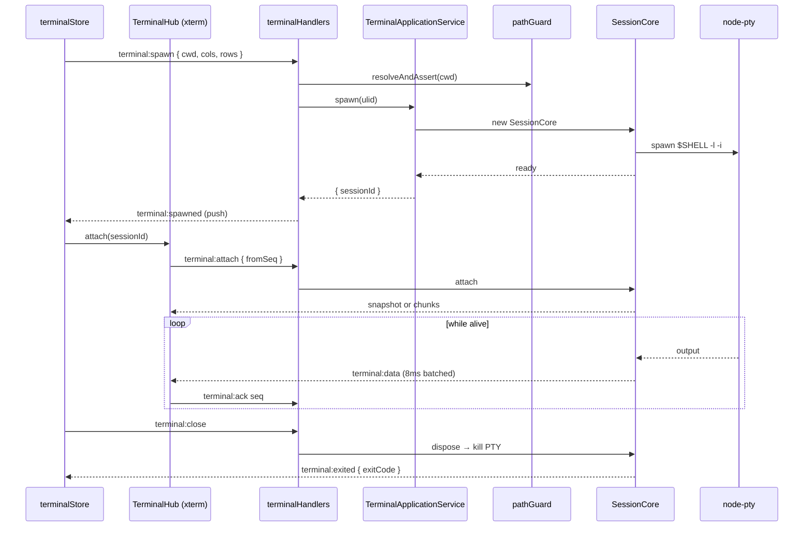

# Terminal

## Purpose

Magenta IDE ships a general-purpose PTY terminal that is independent of AI sessions. It spawns the user's login shell in a chosen cwd, streams output back through the same `SessionCore` infrastructure that AI sessions use, and renders through xterm.js in the dock. Unlike AI sessions it has no DB persistence, no resume mechanism, and no provider registry — each terminal is ephemeral.

## User-visible surface

Terminals are hosted by the dock as either center tabs or bottom-panel tabs. The component is `MagentaTerminal.tsx` (under `packages/ui/src/renderer/components/common/`). Multiple terminals can coexist; each has its own tab.

## IPC contract

| Direction | Type | Payload |
|-----------|------|---------|
| Request | `terminal:spawn` | `{ cwd, cols, rows }` — returns a sessionId |
| Request | `terminal:input` | `{ sessionId, data }` |
| Request | `terminal:resize` | `{ sessionId, cols, rows }` |
| Request | `terminal:close` | `{ sessionId }` |
| Request | `terminal:attach` | `{ sessionId, fromSeq? }` |
| Request | `terminal:ack` | `{ sessionId, seq }` |
| Push | `terminal:spawned` | `{ sessionId }` |
| Push | `terminal:data` | `{ sessionId, data, seq }` |
| Push | `terminal:exited` | `{ sessionId, exitCode }` |
| Push | `terminal:heartbeat` | `{ sessionId, headSeq, alive }` |
| Push | `terminal:attach:result` | `{ sessionId, chunks, snapshot, headSeq, alive }` |

## Daemon

- `packages/daemon/src/application/TerminalApplicationService.ts` — maps `sessionId` to a `SessionCore`. Handles spawn, write, resize, close, attach, ack. Builds the PTY env (strips `npm_*` and `ELECTRON_*`, sets `COLORTERM=truecolor` and `TERM=xterm-256color`).
- `packages/daemon/src/infrastructure/terminal/SessionCore.ts` — the same PTY wrapper used by AI sessions. Owns the `IPty`, tees output into a seq-numbered `RingBuffer`, batches chunks in 8 ms windows, emits heartbeats.
- `packages/daemon/src/ipc/handlers/terminalHandlers.ts` — thin IPC adapters. Generates session ids via `ulid()` (AI sessions use `randomUUID()`).

## Renderer

- `packages/ui/src/renderer/store/terminalStore.ts` — map of `sessionId → { sessionId, cwd, status }`. Actions: `spawn`, `write`, `resize`, `close`, `setExited`.
- `packages/ui/src/renderer/terminal/TerminalHub.ts` — shared xterm-instance hub. The same hub is used by AI sessions and generic terminals; the two just spawn different backends.

## Data model

No database persistence. `TerminalSession` is a UI-only record of `{ sessionId: ULID, cwd, status: 'connecting' | 'active' | 'closed' }`.

## Flows

### Spawn

1. The renderer calls `terminal:spawn` with the target cwd and initial viewport size.
2. `pathGuard.resolveAndAssert` checks the cwd is inside the configured allowlist; `ulid()` generates the session id.
3. The service spawns the user's login shell through `$SHELL -l -i -c <no command>` on Unix, or the shell binary directly on Windows.
4. `SessionCore` wires output into the ring buffer and fires `terminal:spawned`.

### Stream

Same attach/ack/heartbeat dance as AI sessions (see [`ai-sessions.md`](./ai-sessions.md)): the renderer attaches with `fromSeq`, gets chunks or a snapshot, acknowledges as it renders, and heartbeats keep the liveness signal honest.

### Close

`terminal:close` calls `SessionCore.dispose()` which kills the PTY; `terminal:exited` fires with the shell's exit code.

## Guardrails

- `pathGuard` is applied to every spawn cwd the same way it is for AI sessions; users cannot spawn shells in arbitrary directories.
- The env is cleaned before handing it to `IPty`: `npm_*` and `ELECTRON_*` are stripped so the spawned shell does not inherit Electron-specific state.
- There is no `args` passthrough. The shell is always spawned as a login interactive shell with no extra flags.

## Notes

- Completely ephemeral: on app restart every terminal is killed. There is no resume or history surface for terminals — that is by design. Use the [synced sessions](./synced-sessions.md) feature for history.
- `terminal:ack` is currently more of a hook than active backpressure; emit-side 8 ms batching does most of the rate limiting. The ack value is recorded so future backpressure can be added without another breaking schema change.
- Both AI sessions and generic terminals wrap `SessionCore`; the difference is that terminals spawn a shell directly, while AI sessions spawn a CLI tool through a login shell.
