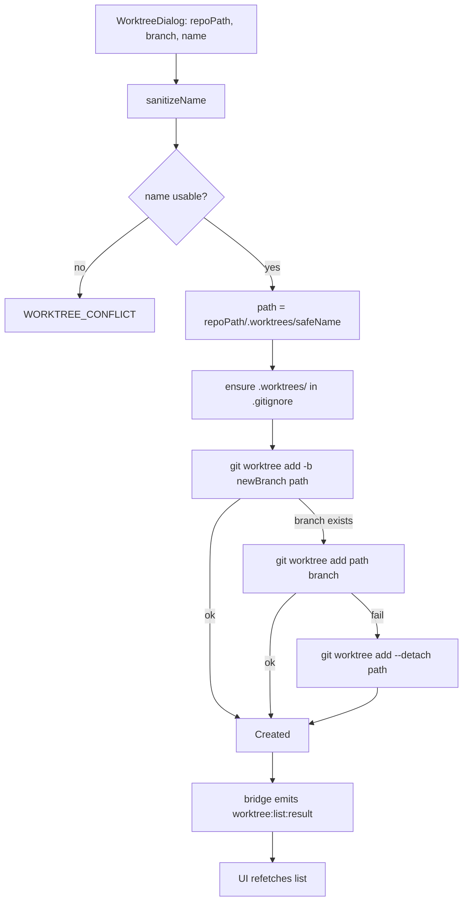
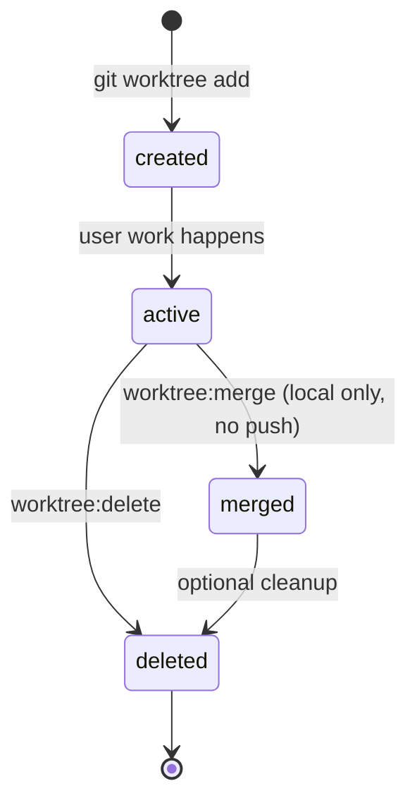

# Worktrees

## Purpose

Magenta IDE uses git worktrees to isolate work per branch or per agent. A worktree is created at `<repoPath>/.worktrees/<name>`, checked out on its own branch, and optionally seeded with an AI session that runs inside that worktree. The Worktrees feature owns creation, listing, status, merge, delete, and the small check-worktree helper that AI sessions use to validate their cwd. Worktrees are not persisted in the DB — the source of truth is `git worktree list`.

## User-visible surface

- `WorktreesView.tsx` (center tab) — worktrees grouped by repo, expand/collapse, inline status with ahead/behind counts, Merge and Delete actions.
- `WorktreeInlinePanel.tsx` — compact status panel used inside dialogs and side panels.
- `WorktreeDialog.tsx` — create worktree.
- `CreateBranchOrWorktreeDialog.tsx` — unified "create new branch or new worktree" picker.
- `RepoFileChanges.tsx` (activity panel) — takes an optional `worktreePath` prop and, when present, sources its file status from `worktreeStore.fetchWorktreeStatus` with a 60 s auto-refresh.

## IPC contract

| Direction | Type | Payload |
|-----------|------|---------|
| Request | `worktree:create` | `{ repoPath, branch, name }` |
| Response | `worktree:create:result` | `{ repoPath, worktreePath, branch, success }` |
| Request | `worktree:list` | `{ repoPath? }` |
| Response | `worktree:list:result` | `{ worktrees }` (also pushed after create / delete to trigger a refetch) |
| Request | `worktree:status` | `{ repoPath, worktreePath }` |
| Response | `worktree:status:result` | `{ worktreePath, files, ahead, behind }` |
| Request | `worktree:merge` | `{ repoPath, worktreePath, worktreeBranch, targetBranch }` |
| Response | `worktree:merge:result` | `{ success, message }` |
| Request | `worktree:delete` | `{ repoPath, worktreePath }` |
| Response | `worktree:delete:result` | `{ success, message }` |
| Request | `worktree:branches` | `{ repoPath }` |
| Response | `worktree:branches:result` | `{ repoPath, branches, current }` |
| Request | `ai-session:check-worktree` | `{ worktreePath, repoPath }` |
| Response | `ai-session:check-worktree:result` | `{ valid, repoPath, worktreeName }` |

`WorktreeEntry` is `{ repoPath, worktreePath, branch, name, createdAt }`.

## Daemon

- `packages/daemon/src/application/WorktreeApplicationService.ts` — orchestrates list (after checking the repo still exists on disk; missing repos are cleaned from the DB), status, merge (validates `worktreeBranch !== targetBranch`), delete, and create.
- `packages/daemon/src/infrastructure/GitGateway.ts` — holds the actual git operations:
  - `listWorktrees` parses `git worktree list --porcelain` once, strips the main worktree (first block), and handles both `branch refs/heads/X` and `detached` entries.
  - `createWorktree` tries `git worktree add -b <newBranch>`, falls back to reusing an existing branch, and falls back again to `--detach` if both fail.
  - `getWorktreeStatus` runs `git status --porcelain` plus the ahead/behind calculation.
  - `mergeWorktree` runs `git merge <worktreeBranch>` inside the main repo while `targetBranch` is checked out.
  - `removeWorktree` runs `git worktree remove`.
  - `ensureGitignoreEntry` appends `.worktrees/` to `.gitignore` (best-effort).
- `packages/daemon/src/ipc/handlers/worktreeHandlers.ts` — thin IPC adapters.
- `sanitizeName` in `packages/daemon/src/domain/sanitizeName.ts` cleans user-supplied names into safe directory segments; if sanitisation leaves nothing usable, the service throws `WORKTREE_CONFLICT`.

## Renderer

- `packages/ui/src/renderer/store/worktreeStore.ts` — `worktrees: WorktreeInfo[]` (deduped by path), `statusCache: Record<path, WorktreeStatus>`, `expandedRepos`, `expandedWorktreePath`. Key methods:
  - `fetchWorktrees(repoPath)` / `fetchWorktreesForAll(repoPaths[])` — the bulk variant uses `Promise.allSettled` so one slow repo does not block the rest.
  - `fetchWorktreesIfNeeded` — caches via a `scannedRepoPaths` set.
  - `getWorktreeForBranch(repoPath, branch)` — lookup used when the UI needs to check if a branch already has a worktree.
  - `addWorktree` / `mergeWorktree` / `deleteWorktree` — mutations that also clear the relevant status cache entry.

## Data model

Worktrees are not stored in SQLite. `git worktree list --porcelain` is the source of truth; the renderer caches what it gets. `createdAt` is best-effort: `fs.stat().mtimeMs` on the worktree directory, falling back to `Date.now()` if that fails.

Worktree directories always live under `<repoPath>/.worktrees/<sanitizedName>`. The first worktree creation on a repo ensures `.worktrees/` is in `.gitignore`.

## Flows

### Create a worktree

### Lifecycle at a glance

### Create a worktree (steps)

1. `WorktreeDialog` collects `repoPath`, `branch`, `name`.
2. The service sanitises the name, derives the path (`<repoPath>/.worktrees/<safeName>`), and ensures `.worktrees/` is in `.gitignore`.
3. `GitGateway.createWorktree` attempts `git worktree add -b <newBranch> <path>`. If the branch already exists, it retries without `-b`. If that also fails it falls back to `--detach`.
4. The bridge pushes a `worktree:list:result` signal so the renderer refetches the list.

### List

A single `git worktree list --porcelain` call parses into per-block entries. The first block (the main worktree) is compared to `mainWorktreePath` and dropped. Branches that show `detached` in the porcelain output are labelled `(detached)`. Names default to `path.basename(worktreePath)`.

### Merge

The UI passes `{ worktreeBranch, targetBranch }`. The service rejects self-merges, then runs `git merge <worktreeBranch>` in the main repo while the target branch is checked out. The response carries `{ success, message }`. The merge is local — nothing is pushed.

### Delete

`worktree:delete` runs `git worktree remove`. The bridge pushes `worktree:list:result` so the renderer drops the row and clears its status cache entry.

### AI session integration

When a new AI session is created with `worktreePath`, the daemon validates the path via `ai-session:check-worktree` which returns `{ valid, repoPath, worktreeName }`. This ensures an AI session cannot be attached to a stale or nonexistent worktree.

## Guardrails

- Name sanitisation is mandatory. A name that sanitises to empty raises `WORKTREE_CONFLICT`.
- The main worktree is filtered out of `listWorktrees` output so users never accidentally try to delete it through the UI.
- `listWorktrees` checks `fs.existsSync(repoPath)` first; if the repo is gone, the DB row is cleaned up (a worktree can't exist without its repo).
- Merge rejects `worktreeBranch === targetBranch` up front.
- `createWorktree` is defensive about branch state — if `-b` fails because the branch exists, it retries without creating, and only falls back to `--detach` as a last resort.

## Notes

- Merge does not push. Users must push the target branch separately after a merge.
- There is no rebase or fast-forward-only variant — `git merge` is the only integration path.
- `createdAt` is a directory mtime, not a true creation timestamp. If the worktree is moved or touched, the reported time shifts.
- `fetchWorktreesForAll` previously ran serially across repos; it was switched to `Promise.allSettled` so one slow repo cannot stall the global list.
- Worktrees are fetched lazily. There is no daemon-side scheduler for them — the renderer drives when to refresh.
